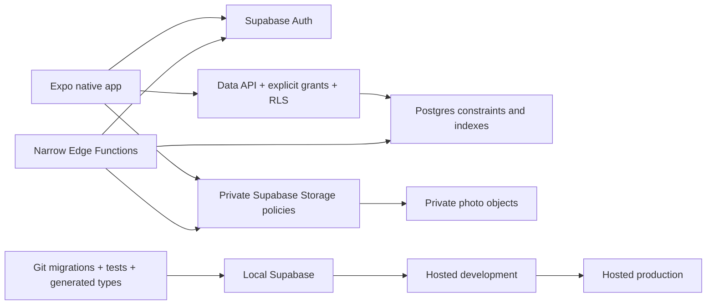

# PROJECT.md — Orca

## 0. Current status

**Last audited:** July 26, 2026

**Release target:** a production-quality, store-releasable, native iOS and Android V1

**Active implementation phase:** Phase 2 — Accounts, Auth navigation, and profiles. Phase 1's physical-device acceptance is explicitly deferred until before external platform testing.

**Collaboration mode:** Guided pair-builder. The AI implements coherent checkpoints, runs routine CLI commands, verifies them, and may create/push a green Git checkpoint while reporting it afterward. The developer reviews the important flow, security boundaries, and evidence without being required to memorize boilerplate syntax. Database promotions, destructive operations, and external releases retain separate review gates.

### What is complete

- The product thesis and initial V1 scope are defined.
- Expo SDK 57, React Native, TypeScript, and Expo Router are installed.
- The app runs in the iOS Simulator.
- Home, Camera, and Memories placeholder tabs exist.
- Strict TypeScript and lint/format scripts exist.
- The local toolchain is pinned to Node `24.14.1` and npm `11.11.0`; clean install, TypeScript, and all 20 `expo-doctor` checks pass.
- Expo is explicitly limited to iOS and Android, iPad support is disabled for phone-only V1, and direct React Native web configuration, script, and dependencies are removed.
- Production and development variants now resolve to distinct names, URL schemes, iOS bundle identifiers, and Android package identifiers; shared static Expo configuration remains intact.
- `.env` is ignored and `.env.example` contains only public variable names.
- A local working baseline exists at commit `1878f3b`.
- The private GitHub repository is connected as `origin`; local `main` tracks `origin/main` through protected-route commit `8f8feff`.
- The direct dependency manifest has been audited: unused template packages are removed, Expo/Router-required packages remain, and `@supabase/supabase-js` `2.110.8` plus `react-native-url-polyfill` `4.0.0` are exactly pinned at their current published versions.
- Supabase CLI `2.109.1` is exactly pinned as a project dev dependency, and `supabase/config.toml` initializes the local backend with Postgres 17 and explicit-by-default Data API grants.
- The Docker-backed local Supabase stack is running; a clean reset applies both version-controlled migrations and the seed input, Mailpit/Studio and backend services are healthy, and a direct query verifies local Postgres `17.6`.
- Security-foundation commit `b5ea078` establishes the unexposed `private` schema and least-privilege schema/object defaults. A clean reset applies it successfully; all 16 pgTAP assertions pass; Security Advisor reports no warnings; and the transactional probe objects leave no residue.
- The pinned CLI is authenticated and linked only to the healthy hosted development project `orca-dev` (`evuqnmvcnqhkzkitszqp`, `ca-central-1`); the ref matches the ignored app `.env`.
- `npx supabase db push --dry-run` completed successfully against the linked development project and identified only `20260726040517_security_foundation.sql` for promotion. The dry run applied nothing.
- Migration `20260726040517_security_foundation.sql` is applied to hosted development and local/remote migration history now matches.
- All 16 equivalent remote security assertions pass, including rollback-only future-object probes, and every probe object is absent afterward.
- Guarded migration `20260726233832_restrict_rls_auto_enable_execution.sql` is applied to hosted development and recorded in matching local/remote migration history. Its post-push pg-delta catalog-cache warning did not roll back the migration.
- Hosted Security Advisor now reports no warnings after the guarded migration revoked direct execution of `public.rls_auto_enable()` from `PUBLIC`, `anon`, `authenticated`, and `service_role` without disabling its event trigger.
- Hosted Performance Advisor also reports no warnings after promotion.
- All 16 pgTAP assertions pass both locally and against hosted development; the linked test uses a transaction-local `set role postgres` because CLI 2.109.1's temporary login may assume but does not inherit `postgres` schema privileges. A separate hosted query confirms all six rollback probes are absent.
- Generated public-schema types are committed at `src/types/database.ts`, excluded from Prettier rewriting, checked for exact drift, and used by `createClient<Database>()`.
- GitHub CI runs separate App quality and Database quality jobs on pushes to `main` and pull requests. Run `30227256433` passes both jobs and proves clean install, formatting, zero-warning lint, TypeScript, Expo compatibility/Doctor, migration replay, database lint, all 16 pgTAP assertions, and generated-type identity.
- The project README documents setup and explicit local versus linked Supabase workflows. GitHub's dependency graph and Dependabot alerts are enabled; automatic update PRs remain disabled. The current private personal-repository plan does not enforce branch rules, so intentional `main` changes require a reviewed diff and green CI by documented team practice until the repository moves to an enforcement-capable plan.
- The native Supabase client now uses an isolated Expo Crypto AES-GCM session adapter: ciphertext stays in AsyncStorage, its random AES-256 key stays in Expo SecureStore, and per-key operations are serialized. Missing, legacy, or corrupt data fails closed to signed-out state. Foreground/background token-refresh ownership remains centralized with cleanup.
- EAS project `@kingstondu/orca` (`dc295559-844a-48f4-924a-e653c31602cd`) has been created under the verified `kingstondu` Expo account and linked through `app.json`.
- The minimal EAS development profile and public development environment are configured for both platforms and pushed. Android development build `38ec9b82-8472-4e99-9b04-fa8bbdb1b013` finished successfully from commit `18765b7` using the Expo-managed keystore; physical Android acceptance remains deferred.
- Protected routes now live under `(app)` and signed-out routes under `(auth)`. One Auth provider derives `user` from the restored session, subscribes synchronously to `onAuthStateChange`, exposes local-device sign-out, and drives stable Expo Router `Stack.Protected` guards without a duplicate `getSession()` call.
- The local account/profile foundation adds `public.profiles`, private `account_states`, locked-down Auth creation and timestamp triggers, active-account/self-only RLS, explicit Data API/column grants, constraints, and regenerated public database types. Clean replay, schema lint, all 53 pgTAP assertions, local Security and Performance Advisors, type drift, and all app quality gates pass. It has not been applied to hosted development.

### What is currently in progress

- The encrypted session adapter compiles, passes all static checks, and loads in the iOS Simulator; native encryption/read/remove/corruption/reinstall behavior still requires a development build on a physical iPhone. Full authenticated restore/refresh/sign-out acceptance follows when Phase 2 adds the Auth provider and operations.
- Apple Developer Program enrollment and the physical-iPhone EAS build are intentionally deferred while Apple's account process is delayed. Simulator-based iOS development may continue, but this temporary acceptance gap must close before the first external iOS tester or TestFlight build. Orca is iOS-first during active development; physical Android acceptance is deferred until before the first Android tester and remains required for Android release readiness.
- `src/app/(auth)/sign-in.tsx` is an unfinished UI draft with no Auth operation yet.
- The locally verified account/profile migration is awaiting developer review and a coherent commit before any separately approved hosted dry run or promotion.
- Phase 1B is complete. Do not amend either migration already recorded remotely.
- TypeScript, formatting, zero-warning lint, dependency compatibility, and all 20 `expo-doctor` checks pass locally. Expo Go on the iOS Simulator confirms that a restored signed-out state reaches the Auth group and cannot display the tabs; the sign-in route remains an intentionally unstyled static shell.
- The July 25 dependency baseline reports 20 total transitive advisories. With dev dependencies omitted, it reports 11 moderate and zero high/critical findings, all routed through Expo configuration/build tooling (`@expo/*`, `xcode`, and `uuid`). npm's proposed automatic resolution would downgrade Expo incompatibly, so these are monitored for an Expo-compatible upstream fix rather than force-fixed.

### What does not exist yet

- No promoted hosted app-data tables, private Storage buckets, or production Supabase project
- No completed iOS development build, error monitoring, E2E tests, or store-release setup

### Immediate checkpoint

The hosted-development linking and initial promotion are complete. The authenticated account identified `orca-dev` as project `evuqnmvcnqhkzkitszqp`; its ref matches `.env`, it is healthy in `ca-central-1`, the CLI marks only that project as linked, and migration `20260726040517` is recorded both locally and remotely.

Hosted linking, security promotion, generated types, CI, repository safeguards, encrypted-session implementation, minimal EAS development configuration, the first Android cloud build, and the protected Auth route boundary are complete through `8f8feff`. The profile/account-state backend foundation is now implemented and fully verified locally: clean replay, schema lint, 53 pgTAP assertions, local advisors, generated-type identity, and all app gates pass. Review and commit this checkpoint before a separately approved hosted dry run and promotion; do not enable sign-up yet. Physical platform gates remain deferred as documented.

---

## 1. How to use this plan

This document is Orca's product, architecture, and delivery source of truth. The codebase remains the source of truth for what is actually implemented.

The phases are ordered by dependency and risk, not by calendar time. Follow them in order unless a real finding requires a documented change. Within a phase, complete one checkpoint, review it, run the gate, and make a coherent commit before taking the next checkpoint.

The plan optimizes **total time to a dependable release**, not the fewest lines or fastest demo. It deliberately avoids both tutorial shortcuts that create security rework and enterprise layers that a 12–15-person app does not need.

### Status rules

- **Planned** means agreed direction, not implemented.
- **Complete** means the phase gate passed, not merely that the happy path rendered once.
- A temporary shortcut must be labeled, bounded to a phase, and removed by its stated gate.
- A feature cannot advance if its authorization or destructive lifecycle is still undefined.
- Update the status block above after every confirmed checkpoint or material decision.

### Release cuts

1. **Developer build:** one developer can exercise the current slice safely.
2. **Private alpha:** 2–3 trusted friends test the immediate posting loop with disposable test media.
3. **Memory beta:** the intended 12–15-person group tests organic posting and historical recall using the production backend.
4. **Release candidate:** both store binaries, operations, safety, deletion, privacy, accessibility, recovery, and reviewer flows pass.
5. **Production V1:** staged App Store and Play Store rollout with monitoring and rollback procedures.

---

## 2. Product contract

### Product summary

**Orca is a private social photo journal for real friend groups.**

Friends share casual photos from ordinary life, react and comment in the moment, and automatically build a private shared history they can revisit later.

> **Post for now. Remember it later.**

### Product thesis

> Close friend groups will post casual photos to Orca because it provides the immediate fun of sharing with the group while quietly creating the shared memory archive that group chats do not become.

### Core loop

> **Do something → post it → friends react → it becomes group history → rediscover it later**

The immediate loop must work before the memory loop is expanded:

1. Pick or take one photo.
2. Choose one real Circle.
3. Publish quickly.
4. Friends see it, react, and comment.
5. Orca preserves capture time and organizes the archive.
6. Memories, Moments, and Rewind create a reason to return.

### Product principles

- **Now first, nostalgia second.** Posting should feel casual; organization happens afterward.
- **Private by default.** The database, Storage, caches, notifications, and operations must agree on visibility.
- **The group is the product.** Profiles support Circles; Orca is not a follower network.
- **No performance pressure.** No public counts, discovery feed, creator mechanics, or algorithmic ranking.
- **Fewer taps.** Posting friction is existential.
- **Captured time matters.** Importing an old photo must not pretend it was taken when it was shared.
- **Earn complexity.** Add infrastructure when a demonstrated product or release requirement needs it.

### Vocabulary

- **User:** a Supabase Auth identity with an Orca profile.
- **Profile:** display name and optional avatar. There is no public user directory in V1.
- **Circle:** a private group with members and admins.
- **Everyone:** an aggregate view of all real Circles the current user may access; never a database Circle or posting audience.
- **Post:** exactly one photo shared by one author to one Circle, with an optional caption.
- **Moment:** a deterministic group of temporally related posts from one Circle.
- **Memories:** the long-term archive ordered by capture time.
- **Rewind:** a derived resurfacing of old authorized content.

### V1 success

V1 is successful when the intended friend group can reliably and privately complete both loops:

- Multiple friends—not only the founder—organically post and interact.
- Posting succeeds under normal mobile interruptions and gives an understandable retry path when it does not.
- No user can retrieve another Circle's rows or media by changing client requests.
- Old and newly taken photos appear at credible points in Memories.
- Friends voluntarily revisit or share an old memory.
- The app can be operated, moderated, backed up, restored, and removed from a user's life without manual database improvisation.

### V1 scope

V1 includes:

- Email/password account creation, verification, recovery, sign-in, and sign-out
- Lightweight profiles with optional private avatars
- Create, join, leave, administer, and invite into Circles
- Everyone aggregate and individual Circle views
- One-photo posting from the system camera or photo picker
- Optional caption and credible capture date
- Private media delivery
- Cursor-paginated Home feed
- Reactions and one-level comment replies
- Blocking, reporting, Circle removal, moderation operations, and legal acceptance
- Memories, historical single-photo import, automatic Moments, and simple Rewind
- Minimal useful push notifications if alpha evidence supports them
- In-app and web-initiated account deletion
- iOS and Android store release, monitoring, backup, and recovery

V1 deliberately excludes:

- Video
- Direct messages or a group-chat replacement
- Followers, friending, public profiles, public discovery, or search across all users
- Posting to multiple Circles at once
- User-created albums or scrapbook editing
- Bulk camera-roll import
- Location sharing or maps
- Contacts access
- Custom camera UI, filters, or editing tools
- AI features
- Polls, plans, bucket lists, journals, streaks, and engagement games
- An offline-first mutation queue
- A web application

Video is a V1.1 decision only after photo upload, playback-free feed performance, moderation, Storage cost, and backup behavior are dependable.

### Audience assumption

V1 account eligibility is **18+**. Onboarding records an adult-eligibility self-attestation and the accepted legal-document versions without collecting a full birth date. Store targeting, terms, marketing, and the actual tester population must tell the same truth. If the intended users include anyone under 18, pause before their onboarding and expand the child-safety, consent, privacy, and legal plan rather than mislabeling the app.

---

## 3. Product and engineering decisions

### System shape



Ordinary app reads and writes go directly through the publishable-key client and remain safe because grants, RLS, constraints, and Storage policies authorize them. Edge Functions are not a generic middle tier; they exist only for privileged cross-system work such as complete deletion, moderation, push, or cleanup.

| Area                 | V1 decision                                                                                           | Why                                                                                                          |
| -------------------- | ----------------------------------------------------------------------------------------------------- | ------------------------------------------------------------------------------------------------------------ |
| Platforms            | Native iOS and Android only                                                                           | Matches the product; removes unused web branches and testing burden.                                         |
| Runtime              | Expo managed workflow with Continuous Native Generation                                               | Fastest route to reliable native builds without committing generated native projects.                        |
| Navigation           | Expo Router route groups and `Stack.Protected`                                                        | Clear auth/app separation; RLS remains the real security boundary.                                           |
| Backend              | Expo client talks directly to Supabase Data API under RLS                                             | Simple and appropriate for a small social app.                                                               |
| Trusted backend work | Narrow Postgres RPCs for transactions; Edge Functions only for service-key or multi-system work       | Keeps ordinary CRUD simple without putting privileged credentials in the app.                                |
| Database workflow    | Hand-written, version-controlled imperative migrations                                                | Stable and reviewable; do not adopt the still-alpha declarative schema workflow.                             |
| Environments         | Local Supabase + existing hosted development project + separate production project before memory beta | Gives reproducibility and safe promotion without paying the complexity cost of staging.                      |
| Authentication       | Email/password only in V1                                                                             | Reliable, teachable, and avoids unnecessary OAuth/provider obligations.                                      |
| Email confirmation   | In-app verification code using Supabase email OTP templates                                           | Faster and more dependable in native alpha than making basic signup depend on email-client deep links.       |
| Session persistence  | Encrypted serialized session in AsyncStorage; encryption key in Expo SecureStore                      | Protects bearer tokens while avoiding native key-store value-size limits.                                    |
| Auth state           | One Auth provider; synchronous auth callback; one initial restoring state                             | Prevents route flicker and duplicated listeners.                                                             |
| Profile visibility   | Self, current shared-Circle users, or viewers of that user's still-visible shared content             | Prevents global enumeration while preserving attribution for Circle history after someone leaves.            |
| Invitations          | High-entropy, expiring, revocable tokens; only a hash is stored                                       | No public username directory is needed to join friends.                                                      |
| Server state         | TanStack Query when the first real profile/Circle queries are introduced                              | Feed pagination, mutation invalidation, retry, and cache clearing justify it; auth itself stays outside it.  |
| Local state          | Component state and small focused Context only                                                        | Avoids premature global-state architecture.                                                                  |
| Forms                | Local controlled state first                                                                          | Auth and V1 forms are small; add a form library only if repetition becomes real.                             |
| Styling              | React Native `StyleSheet` plus a small token file                                                     | Fast, readable, and sufficient before a reusable design system emerges.                                      |
| Media                | System camera/picker, one normalized image, private Storage                                           | Faster and more reliable than a custom camera; no broad library access is required.                          |
| Upload               | Reserve pending post → upload exact object → verify/finalize publish                                  | Makes retries idempotent and lets Storage authorize against a real pending row.                              |
| Feed order           | `(created_at, id)` cursor                                                                             | `created_at` is server-controlled sharing time; keyset pagination remains stable.                            |
| Memory order         | `(captured_at, id)` cursor                                                                            | Preserves the date the memory occurred, including historical imports.                                        |
| Realtime             | Off initially; refetch after mutations, focus, and pull-to-refresh                                    | Canonical data is more important than socket complexity for 15 friends.                                      |
| Realtime later       | Private Broadcast invalidations, followed by RLS-protected refetch                                    | Add only if alpha shows comments/reactions feel broken without it.                                           |
| Analytics            | Database-derived aggregate product signals plus tester notes; no ad/tracking SDK                      | Enough to evaluate the loop with much less privacy surface.                                                  |
| Crash monitoring     | Sentry before private alpha, with PII/media/tokens scrubbed                                           | External testers need actionable crash evidence without exposing private content.                            |
| Notifications        | Add after the interaction loop works; generic private copy                                            | Avoids premature infrastructure and lock-screen leakage.                                                     |
| Deployment           | EAS development, preview, beta, and production profiles                                               | Separates dev-client work, production-like dev testing, production-backed internal beta, and store binaries. |
| OTA updates          | Disabled until production binaries are reliable; optional later with code signing and staged channels | Avoids adding a second deployment system during core development.                                            |

### Explicit non-decisions

- Do not introduce repository/service/factory layers around Supabase.
- Do not put server data into a general global store.
- Do not add Realtime, background upload, AI, or push because they sound production-like.
- Do not run `npm audit fix --force`; use Expo-compatible upgrades and assess production-reachable findings.
- Do not use the deprecated Supabase `processLock` option. Current Auth coordinates refresh; Orca owns only app foreground/background refresh lifecycle.
- Do not use the Supabase dashboard as the persistent schema editor.
- Do not put signed URLs, access tokens, emails, captions, or report details in logs.

---

## 4. Target application structure

The structure should become feature-oriented as features earn files. Empty folders are not progress.

```text
src/
  app/
    _layout.tsx                  # providers, session restore, protected groups
    (auth)/
      _layout.tsx
      sign-in.tsx
      sign-up.tsx
      verify-email.tsx
      forgot-password.tsx
      reset-password.tsx
    (app)/
      _layout.tsx
      onboarding/
        profile.tsx
      (tabs)/
        _layout.tsx
        index.tsx                # Home
        camera.tsx               # photo composer entry
        memories.tsx
      circles/
        index.tsx
        new.tsx
        join.tsx
        [circleId].tsx
        [circleId]/members.tsx
      posts/
        [postId].tsx
        [postId]/comments.tsx
        [postId]/report.tsx
      moments/
        [momentId].tsx
      profile/
        index.tsx
        edit.tsx
      settings/
        index.tsx
        account.tsx
        privacy.tsx
        notifications.tsx
  components/                    # genuinely cross-feature presentational UI
  constants/
    theme.ts
  features/
    auth/
    profiles/
    circles/
    posts/
    feed/
    reactions/
    comments/
    memories/
    moments/
    safety/
    notifications/                # create only if push is adopted
  lib/
    auth-storage.ts              # isolated encrypted storage adapter
    env.ts                       # validated public configuration
    query-client.ts
    supabase.ts                  # typed client construction only
  types/
    database.ts                  # generated, never handwritten
supabase/
  config.toml
  migrations/
  tests/
  seed.sql
  functions/                     # only when a privileged workflow is earned
assets/
e2e/
```

### Boundary rules

- Route files coordinate navigation and feature components; they should not become data-access monoliths.
- Feature folders contain domain UI, hooks, query keys, and small transformations.
- `components` is for stable UI used by unrelated features, not every button created once.
- Sign-in and create-account are separate route actions. Their first buttons and forms stay local; extract a shared primitive only when its API is proven by reuse.
- `lib/supabase.ts` constructs and exports the typed client. It does not own React listeners or UI state.
- The root Auth provider owns the subscription to `onAuthStateChange`; the root layout owns app-lifecycle refresh and unsubscribes cleanly.
- Database types are generated from migrations. Domain-only view models may be handwritten near their feature.
- Side effects such as upload/finalize/delete should have one clear owner and idempotency behavior.

---

## 5. Navigation and screen contract

### Root session gate

The root Auth boundary has three states:

1. **Restoring:** read/decrypt the persisted session once and show a controlled launch state.
2. **Signed out:** allow only the `(auth)` group.
3. **Signed in:** allow the protected `(app)` group.

Inside `(app)`, a separate profile/onboarding resolver has its own loading state before it chooses onboarding versus tabs. Do not flash tabs while the profile/legal/eligibility query is unresolved.

Use `Stack.Protected` for navigation state. It prevents accidental signed-in screens from remaining in history, but it does not authorize data. Every request still passes grants, RLS, and Storage policies.

### Primary tabs

- **Home:** Everyone or one Circle; reverse sharing chronology.
- **Camera:** immediately opens a simple photo composer using the system camera/picker.
- **Memories:** archive organized by capture time, with Circle filtering.

### V1 screen behavior

#### Auth and onboarding

- Sign in and Create account are distinct routes/actions, not an early generic component abstraction.
- Forms use email/password, inline validation, loading/disabled submit, password visibility control, keyboard-safe layout, and errors that do not reveal whether an unrelated account exists.
- Verification and recovery use a short in-app code flow first.
- Profile setup asks only for display name in Phase 2; once the Phase 4 private avatar workflow exists, avatar remains optional.
- An account with no Circle lands on a warm Create or Join empty state, not an empty feed.

#### Home

- Top area shows the current Circle/Everyone switcher and profile/settings access.
- Feed cards prioritize the photo, then author, share time, optional caption, reactions, and comments affordance.
- Everyone shows the source Circle on each card; a Circle feed does not repeat redundant audience chrome.
- Relative times may be used for recent posts, but detail/accessibility text can expose an exact time.
- Pull-to-refresh is available; infinite pagination is bounded and has a clear end/error state.
- There is no algorithmic ranking, repost, share count, public like count, or follower UI.

#### Camera/composer

- Opening the tab presents Take Photo and Choose Photo; it does not build a custom live camera in V1.
- After selection, show one preview, required Circle audience, optional caption, and captured date.
- Newly taken media defaults capture time confidently; selected historical media shows the detected/approximate date and allows correction.
- Publish has one obvious primary action with progress, cancel where safe, and retry on failure.
- A user must never wonder which Circle will receive the photo.

#### Memories

- Default view is the user's authorized history grouped by capture date, with Everyone/Circle selection.
- Moment cards summarize a time range, Circle, contributors, and a representative photo.
- Singleton posts remain visible in chronological history.
- Rewind is a warm optional surface, never a streak or guilt prompt.
- Sharing an old photo does not move its capture position merely because it was posted today.

#### Circle and member management

- Create asks for a Circle name only.
- Join accepts a code or verified invite link.
- Member list distinguishes admins and makes invite/remove/leave consequences explicit.
- Everyone cannot be opened as a Circle detail or chosen as a posting destination.

#### Profile, settings, and safety

- Profile emphasizes identity inside shared Circles, not public self-presentation.
- Settings contains account/sign-out, blocked users, notification preferences if adopted, privacy/legal/help, and account deletion.
- Report is reachable from the relevant post/comment/profile overflow action.
- Block explains behavior inside a shared Circle and points to admin removal for full group separation.
- Destructive operations name what will be removed and whether recovery is possible.

### Secondary screens

- Auth: sign in, sign up, email verification, forgot/reset password
- Profile: complete/edit identity and avatar
- Circles: create, join by code/link, member list, invite, role/removal/leave controls
- Post detail and comments
- Moment detail
- Settings: account, sign-out, notification preferences, privacy/help/legal, deletion
- Safety: report flow and blocked users

### Visual system

- Start with a small semantic token set for background, surface, text, muted text, accent, danger, spacing, radius, and typography.
- Use platform-native behavior and restrained motion; the product should feel warm, intimate, visual, and playful rather than like a generic admin dashboard.
- Keep media aspect ratios stable to avoid feed layout shifts.
- Support light/dark appearance from the start, but do not build a component library before repeated screens establish real patterns.
- Accessibility labels describe action/context without leaking private captions to system logs or notification previews.

### Required UI states

Every data-driven screen intentionally handles:

- initial loading
- empty content
- success
- recoverable error with retry
- offline/unreachable backend
- authorization lost while open
- destructive confirmation where applicable

Skeletons are optional; truthful state is not.

---

## 6. Client data, cache, and error design

### Ownership

- Supabase Auth session: Auth provider only.
- Remote rows: TanStack Query cache.
- Draft caption, selected photo, form values, open menu: local component state.
- Current Circle selection: route/search state or one small persisted preference after the feed exists.
- Never duplicate a query result into Context or a global store.

### Query conventions

- Query keys include the authenticated user where cached data could cross accounts.
- Circle-specific keys include `circleId`; Everyone has a separate aggregate key.
- Mutations update or invalidate the smallest affected keys.
- Sign-out/account switch cancels requests and performs a best-effort purge of query data, in-memory image/signed-URL caches, upload drafts, and temporary files; server authorization never depends on successful local cleanup.
- App focus and pull-to-refresh refetch important active queries.
- Do not retry authorization, validation, or not-found errors as if they were transient network failures.

### Offline behavior

V1 is **offline-tolerant, not offline-first**:

- Previously cached read data may render with a clear stale/offline state.
- Creating posts, comments, reactions, invites, or membership changes requires connectivity.
- A failed/in-progress upload may keep exactly one bounded app-private normalized draft/manifest across process death so the user can Resume or Discard; it does not become a general offline/background mutation queue.
- Never show an optimistic success that the server did not accept.

### Error boundaries and logging

- Show users plain, actionable errors; preserve technical context for development/monitoring.
- Normalize expected Supabase/Auth/Storage/network failures near the feature that can respond.
- Add a root error boundary for unexpected render failures.
- Sentry receives environment, release/build, update ID, and safe error category only.
- No tokens, email addresses, captions, photo bytes, signed URLs, invite tokens, or full request bodies in logs or breadcrumbs.

---

## 7. Supabase delivery workflow

### Environments

| Environment        | Purpose                                              | Data policy                                                      |
| ------------------ | ---------------------------------------------------- | ---------------------------------------------------------------- |
| Local              | Migrations, Auth email via Mailpit, seed data, pgTAP | Disposable generated test data only                              |
| Hosted development | Simulator/device integration and private alpha       | Disposable test photos; never the only copy of important history |
| Production         | Memory beta, store review, and real users            | No seed reset; migrations promoted from version control          |

The current hosted project becomes development. Create production before importing real historical photos or onboarding the 12–15-person memory beta. A staging Supabase project is not justified yet; EAS preview builds can use development until production smoke testing is required.

### Migration discipline

1. Create a reviewed migration locally.
2. Reset a clean local database from migration zero.
3. Run pgTAP database/RLS tests and database lint.
4. Regenerate `src/types/database.ts` from local schema.
5. Run app checks and verify generated types have no drift.
6. Apply to hosted development with an explicit dry run where available.
7. Test from a development/preview native build.
8. Commit migration, tests, generated types, and client usage together.
9. Promote the identical migration history to production only after the phase gate.

Persistent schema changes never live only in the dashboard. If an emergency or exploratory dashboard change occurs, reconcile it into a clean migration immediately.

After production begins, use expand/migrate/contract changes: add compatible schema/policies first, release clients that can use them, migrate data, and remove old behavior only after the supported installed versions no longer depend on it. A store rollout or OTA rollback may leave older clients active.

### Data API standard

- Client-facing V1 tables and callable RPC entry points live in the Data API's exposed `public` schema. Security helpers, moderation/cleanup state, and other server-only objects live in an unexposed `private` schema.
- Automatic exposure/grant convenience is not trusted. Each migration explicitly configures exposure, grants, and RLS.
- Grant nothing on application data to `anon` unless a later public endpoint has a documented reason.
- Grant `authenticated` only required operations or columns.
- RLS is explicitly enabled on every exposed table, even if a dashboard default claims it will happen automatically.
- Grants answer “can this role call the operation?”; RLS answers “which rows may this user affect?” Both must pass.
- `UPDATE` requires visible rows plus correct `USING` and `WITH CHECK` behavior.
- Policies use `(select auth.uid())`, explicit filters, and indexes on membership/foreign-key columns.
- Views exposed to the API use invoker security.
- Client-callable transactional RPCs use a thin exposed `public` **security-invoker** entry point with `PUBLIC`/`anon` execution revoked and only the intended role granted. When elevated database rights are unavoidable, that entry point calls one narrowly granted `private` **security-definer** helper that independently derives/validates `auth.uid()`, sets an empty `search_path`, and fully qualifies every object. Uncallable policy/trigger helpers stay private. Edge Functions remain preferable for multi-system/service-key work.
- Never authorize with user-editable Auth metadata.

### Types and package policy

- Generate and commit database types after every schema migration.
- Construct `createClient<Database>()`; do not recreate table row types by hand.
- Pin direct non-Expo runtime packages exactly and commit the npm lockfile.
- Install Expo/native packages through `npx expo install` at SDK-compatible versions.
- Pin Node to the version supported by Expo SDK 57 and use the same major in CI/EAS.
- Run `npx expo install --check` and `npx expo-doctor` at foundation and release gates.
- Treat audit results by reachability and compatible fixes. Never force a dependency tree onto incompatible Expo versions.

### CI baseline

Every pull request and push to `main` should run:

- clean `npm ci`
- format check
- lint with zero warnings at a checkpoint
- TypeScript check
- unit/component tests when introduced
- Expo dependency compatibility/doctor check
- local Supabase reset
- database lint and pgTAP tests
- generated database-type drift check

Production deployment remains a manual approval, not an automatic side effect of merging.

---

## 8. Data model

All timestamps use `timestamptz`. User-facing IDs use UUIDs. Names/captions/comments have database length and nonblank constraints. Every foreign key receives an index when its reverse lookup, RLS policy, cleanup, or join needs one.

### Managed identity

#### `auth.users`

Supabase owns credentials, sessions, confirmation, and recovery. Email is not copied into public profile rows and is never used as an authorization field.

### Core identity and groups

#### `profiles` — Phase 2

- `id` UUID primary key referencing `auth.users.id`
- nullable `display_name` only while onboarding is incomplete; every nonnull value is trimmed/nonblank and length constrained
- nullable `avatar_path`
- nullable `onboarding_completed_at`
- `created_at`, `updated_at`

A tested Auth trigger creates the incomplete row without trusting `user_metadata`. A constrained self-update completes onboarding atomically with required legal/age records. Incomplete profiles are self-only. A completed user can update only permitted fields on their own row. Later-phase read visibility is self, a current shared Circle, or a viewer who can still read that user's published contribution in one of their Circles. This preserves historical attribution after a member leaves without enabling global enumeration. Username/global search is omitted.

#### Private `account_states` — Phase 2

- one row per Auth user with checked state such as `active`, `suspended`, or `deleting`
- server-controlled timestamps/reason reference; no client update grant

Every authorization helper first requires the caller and relevant account to be active. Setting `deleting`/`suspended` therefore blocks an already-issued access JWT at the database/Storage boundary while refresh sessions are revoked and cleanup proceeds. Absence of an active row denies access.

#### `circles` — Phase 3

- `id` UUID primary key
- constrained `name`
- nullable historical `created_by`
- server-controlled state such as `active` or `deleting`
- `created_at`, `updated_at`

Creation happens through one transaction that creates the Circle and its first admin membership. Members can read; admins can rename. A deleting state denies normal access while a retryable trusted workflow removes Storage before relational rows.

#### `circle_members` — Phase 3

- composite primary key `(circle_id, user_id)`
- checked role: `member` or `admin`
- `joined_at`

The client never inserts membership directly. Indexed `(user_id, circle_id)` supports “my Circles” and RLS. A narrow roster RPC derives the caller, validates current Circle membership in a private helper, and returns only member ID, display name, and role, so a blocked person remains identifiable for administration without reopening their full profile/avatar/content. Admin mutations lock consistently so concurrent actions cannot remove the final admin. Leaving/deleting an account must transfer/administer or delete the last-member Circle.

#### `circle_invites` — Phase 3

- UUID primary key and `circle_id`
- cryptographic `token_hash`, never plaintext token
- `created_by`, `created_at`, `expires_at`
- `max_uses`, `use_count`, nullable `revoked_at`

Admin-only creation/revocation and transactional redemption use narrow RPCs. Raw invite tokens are high entropy, returned only when created, redacted from logs, and safe to rotate.

### Posts and media

#### `posts` — Phase 4

- client-generated UUID primary key
- immutable `circle_id` and `author_id`
- status: `pending`, `published`, or `deleting`
- deterministic unique `media_path`
- validated MIME type, byte size, pixel width, and pixel height
- optional constrained `caption`
- required `captured_at`
- `captured_utc_offset_minutes` and capture-time source (`metadata`, `user`, or `fallback`)
- `upload_started_at`
- nullable `created_at`, set by the database only when publish finalizes

`created_at` means sharing time and orders Home. `captured_at` means memory time and orders Memories, Moments, and Rewind. Feed queries expose only published posts.

Constraints make lifecycle state executable: `pending` has no `created_at`; `published` has one; publish cannot reset it; `deleting` remains hidden; `media_path`, author, and Circle are unique/immutable for that post. Actual decoded media metadata is set by trusted finalization rather than trusted from client claims.

The create path is idempotent:

```text
reserve matching pending row
        ↓
normalize and upload exact immutable object
        ↓
server verifies object metadata and finalizes published row
        ↓
created_at becomes the authoritative share time
```

Retries reuse the same post ID and object path. Old pending rows and unmatched objects are reconciled by a cleanup job. Delete marks the post hidden first, removes the object through the Storage API, then removes relational metadata.

### Interaction and safety

#### `reactions` — Phase 6

- composite primary key `(post_id, user_id, reaction_type)`
- small checked reaction allowlist
- `created_at`

A user may add multiple different reaction types but only one of each. There is no update operation: insert or delete one's own reaction.

#### `comments` — Phase 6

- UUID primary key
- `post_id`, nullable `author_id`, nullable `parent_comment_id`
- nullable constrained `body`
- tombstone/deletion timestamps and `created_at`

Only one reply level is allowed. A composite relationship guarantees parent and reply belong to the same post; a trigger or controlled function rejects a reply to a reply. Deleting a parent with replies clears its body/identity and preserves a tombstone. A leaf comment may be removed. Direct broad client DELETE is not granted.

#### `blocks` — Phase 6

- composite primary key `(blocker_id, blocked_id)`
- `created_at`

Blocking is bilateral for content visibility and interaction: neither account can read or interact with the other's profile/posts/comments/reactions, although shared Circle membership remains visible enough for Circle administration. The UI explains that an admin must remove someone to separate them from the group. The database, feed queries, counts, notifications, and caches enforce the same rule.

#### `reports` — Phase 6

- reporter, target kind/identifier, reason, optional constrained detail
- status and moderation timestamps
- created timestamp

Users create reports only through a narrow RPC that derives the reporter, proves the target is currently reportable/visible, allowlists the reason, rate-limits abuse, and server-sets status/timestamps. They can view only a safe status projection for their own reports. Review and action occur through a trusted moderator path. Reports retain the minimum audit data needed after target removal and do not copy private media unnecessarily.

#### `legal_acceptances` — Phase 2

- user, document kind, immutable version, accepted timestamp
- composite uniqueness preventing accidental duplicate acceptance records

Adult-eligibility attestation plus Terms, Privacy Notice, and Community Guidelines versions are recorded through a narrow RPC that accepts only the server-configured active versions/hashes and sets its own timestamp. The client cannot claim a future/arbitrary version. These records are required during onboarding before posting/interactions. Do not store a full birth date merely to support the 18+ launch rule.

### Memory model

#### `moments` — Phase 9

- UUID primary key and `circle_id`
- capture-time start/end bounds
- grouping algorithm version
- optional generated/user-approved title later
- `created_at`, `updated_at`

#### `moment_posts` — Phase 9

- `moment_id`, `post_id`, and `circle_id`
- unique `post_id`, enforcing one Moment maximum per post in V1

Composite foreign keys enforce that the Moment and every included post share the same Circle. Moments have no independent audience and no multi-Circle content.

Moment grouping is deterministic, idempotent, and server-owned. A temporal-gap baseline is tested with real seeded history before the threshold is finalized. Importing an older post can safely recompute only the affected Circle/time window. Single posts remain visible in Memories even when they do not qualify as a multi-post Moment.

Moment membership may remain canonical for the Circle, but every viewer receives only child posts, cover media, contributors, and counts they can currently see. A Moment with no visible children is hidden. Blocking therefore never leaks a blocked author's photo or identity through a Moment summary.

Rewind is a query/selection rule over authorized posts and Moments, not a table in V1.

### Release operations

#### `push_devices` — Phase 11, only if push is adopted

- user, installation/device identifier, Expo push token, platform
- enabled preferences, last-success/error timestamps
- unique current token and timestamps

One account may have multiple devices. Invalid tokens are retired. No service credential exists in the app.

#### Private operational data — Phases 6–12

Moderation roles/actions and cleanup attempts belong in an unexposed private schema. A private `account_deletion_jobs` record stores caller identity, checked stage/status, attempts, safe error category, and timestamps so deletion can resume idempotently; it retains no service secret or unnecessary deleted content. Client-editable metadata never grants moderator rights.

### Delete behavior map

- **Post:** hide → remove Storage object → delete row; reactions cascade; comments follow the defined removal/tombstone rule.
- **Circle:** require authorized destructive confirmation → hide/freeze → remove every media object → delete relational rows.
- **Membership removal:** new server access to other members' Circle data stops immediately at RLS/Storage/Realtime. Existing published contributions remain Circle history by default, while the former author retains access to/delete their own content. The leave/removal UI explains this; account deletion removes the author's media/content under the deletion policy. Local caches are purged best effort and signed links expire quickly, but already copied bytes cannot be remotely revoked.
- **Account:** set nonactive state/revoke refresh first, then a retryable trusted workflow resolves every foreign key, last-admin succession, post/avatar media, comments, reactions, memberships, devices, profile, and finally Auth identity.
- **Comment:** tombstone if replies exist; otherwise hard delete.
- **Report:** retain minimum operational record according to the published retention policy.

---

## 9. Authorization and Storage contract

Authorization is tested from the API with an owner, same-Circle member, different-Circle user, removed member, blocked pair, and unauthenticated client. Hiding a control in React is never evidence of security.

The matrix below is the **final V1 contract**, not the policy shape on day one. Migrations expand it only when their dependencies exist:

1. Phase 2: profile is self-only and active-account checks begin.
2. Phase 3: current shared-Circle profile/roster visibility is added.
3. Phase 4: former-author owner access and visible-historical-attribution rules are added with posts.
4. Phase 6: block predicates, reports, and interaction rules are added.

Each phase tests only the rules its schema can compile, while retaining all earlier negative tests.

Every row in the matrix also requires an active caller account; `suspended`, `deleting`, missing, and anonymous states deny by default unless a deliberately public release endpoint says otherwise.

### Access matrix

| Resource       | Read                                                                                                | Create                          | Change/delete                                 |
| -------------- | --------------------------------------------------------------------------------------------------- | ------------------------------- | --------------------------------------------- |
| Profile        | Self, current shared-Circle user, or viewer of still-visible shared content; excluding blocked pair | Auth trigger                    | Owner fields only; avatar workflow separately |
| Circle         | Current member                                                                                      | Transactional create RPC        | Admin rename; controlled admin/delete RPCs    |
| Membership     | Current Circle member                                                                               | Invite/create RPC only          | Admin/leave RPCs; never remove last admin     |
| Invite         | Circle admins; narrow redemption preview                                                            | Circle admin RPC                | Circle admin revoke; consume transactionally  |
| Pending post   | Author only                                                                                         | Reserve RPC for a Circle member | Author finalize/cancel                        |
| Published post | Author or visible Circle member, excluding blocked pair                                             | Finalize existing pending row   | Author or trusted moderation/delete workflow  |
| Reaction       | Current visible Circle member only; post-author fallback does not extend to interactions            | Own identity only               | Own row only                                  |
| Comment        | Current visible Circle member only; post-author fallback does not extend to interactions            | Own identity and valid parent   | Own controlled delete; moderation path        |
| Block          | Blocker and private policy helpers only                                                             | Own identity                    | Blocker only                                  |
| Report         | Reporter sees own status; moderators via trusted path                                               | Authenticated reporter          | Trusted moderation path only                  |
| Moment         | Visible Circle member; children/cover/participants filtered to that viewer's visible posts          | Server grouping operation       | Server grouping/moderation only               |

The Circle roster projection is intentionally narrower than Profile access: current members may receive member ID, display name, and role for group administration even across a block, but not avatar, profile navigation, posts, or interaction access.

### Storage buckets

#### `post-media`

- Private bucket.
- Immutable path: `{circle_id}/{author_id}/{post_id}/media.jpg`.
- Image-only MIME allowlist and a measured V1 size ceiling no larger than the reliable standard-upload range; target normalized output below 6 MB.
- Upload requires caller = author path segment, current Circle membership, and an exact matching pending post row.
- Storage SELECT allows the author to retrieve their exact matching pending object metadata/content so the current upload API's `INSERT … RETURNING` succeeds; no other user can read a pending object.
- Read requires a matching published post and either its author or current Circle visibility, including blocking rules.
- No client Storage update/upsert permission.
- Delete goes through the controlled post lifecycle, not direct SQL against `storage.objects`.

#### `avatars`

- Private bucket.
- Immutable versioned path under `{user_id}/...`.
- Owner uploads a new object, updates `profiles.avatar_path`, then cleans the previous object.
- Read matches profile self/shared-Circle/visible-contribution visibility.
- Owner delete/write only; no global authenticated read policy.

### Mobile media behavior

- V1 Camera uses the system camera and photo picker through Expo ImagePicker, not a custom preview.
- Request camera permission only when the user chooses camera.
- Use the system picker without broad Android media-library access.
- Disable microphone/audio permission for photo-only V1.
- Never request location, contacts, microphone, or unnecessary EXIF access.
- Handle denial, `canAskAgain`, Settings fallback, cancellation, and unavailable camera.
- Recover Android pending picker results after activity destruction.
- Re-encode/resize locally, remove unnecessary metadata including GPS, preserve dimensions and capture time separately, and remove temporary files.
- React Native Storage upload uses the currently supported binary representation—verify current Supabase docs rather than copying browser `Blob`/`FormData` examples.
- Prevent duplicate taps and make retry/cancel state explicit.

### Private media caching

- Store Storage paths in rows, never signed URLs.
- Generate short-lived URLs only when needed; batch where practical.
- Namespace stable cache keys by environment, authenticated user, session generation, and authorized object path rather than the expiring URL string.
- Do not prefetch an unbounded feed.
- Use memory-only post-media caching for V1 until a user-scoped persistent cache with verifiable purge/protection is deliberately implemented. Do not quietly rely on a shared opaque disk cache for private photos.
- On sign-out/account switch, clear in-memory media/signed-URL state and local drafts best effort. A previously issued signed URL remains usable until its short expiry, and bytes already saved, cached elsewhere, or screenshotted cannot be remotely revoked.
- Membership/block/deletion must stop new server fetches immediately; document and test the signed-URL TTL as the bounded server-link residual window without promising deletion of remote-device copies.

---

## 10. Query and performance contract

### Home

- Circle feed explicitly filters `circle_id` and published status even though RLS also protects it.
- Everyone explicitly filters to current Circle IDs; RLS prevents forged filters.
- Order by `created_at DESC, id DESC`.
- Use a keyset cursor containing both values; never offset an unbounded social feed.

### Memories

- Filter to authorized Circle content.
- Order by `captured_at DESC, id DESC`.
- Use a keyset cursor containing both values.
- Render local capture date using stored offset/source and label fallback/edited dates honestly where needed.

### Initial indexes

- `circle_members(user_id, circle_id)` in addition to its Circle-first primary key
- Every unindexed foreign key used for joins, cleanup, or RLS
- Partial/indexed published feed order `(circle_id, created_at DESC, id DESC)`
- Published memory order `(circle_id, captured_at DESC, id DESC)`
- Reactions and comments indexes required for post loads and account cleanup
- Block-pair lookups in both directions

Add an Everyone/global ordering index only after a real query plan demonstrates it helps. Use `EXPLAIN (ANALYZE, BUFFERS)` on representative development data before speculative indexing.

### Request shape

- Select only fields required by the screen.
- Fetch posts and their required author/interaction summary in bounded queries; avoid one request per feed card.
- Paginate comments and media-heavy history.
- Measure release builds on physical devices; React development performance is not a release benchmark.
- Start with React Native `FlatList` and `expo-image`; replace only after profiling shows a real bottleneck.

### Release performance evidence

For the small alpha/beta, use repeatable scenarios rather than statistically meaningless percentages:

- No duplicate upload or mutation from repeated taps.
- Feed first useful content feels prompt on a warm authenticated session; record device/network/median/p95 only after enough real samples exist.
- Scrolling a representative 100-post history has no sustained visible jank or unbounded memory growth.
- A scripted run of repeated uploads across both platforms—including injected offline, timeout, interruption, retry, and duplicate taps—has no lost-success ambiguity or duplicate published post.
- There is no reproducible critical crash/ANR in a core flow; review App Store/Play/Sentry vitals once their sample size is meaningful.

Define percentage service targets only after naming a minimum sample size and measurement source. These are release signals, not excuses to build elaborate telemetry before the relevant feature exists.

---

## 11. Cross-cutting definition of done

Every checkpoint must satisfy the applicable parts of this section.

### Correctness

- Happy path works.
- Loading, empty, error, retry, and lost-authorization states are intentional.
- Duplicate taps, remounts, backgrounding, and app restart do not duplicate durable work.
- Server facts are protected by constraints, not only client validation.
- Destructive operations are retryable or fail without ambiguous partial success.

### Security and privacy

- SQL grants, schema exposure, RLS, Storage policies, and trusted functions are independently reviewed.
- Positive and negative authorization tests pass.
- No service/secret key or private operational credential enters the app bundle.
- No sensitive content enters logs, analytics, notifications, or error reports.
- New dependencies and permissions have an explicit need.
- Sign-out/account switch clears private local state.

### Engineering quality

- Format, lint, strict TypeScript, relevant tests, and Expo compatibility checks pass with no ignored errors.
- Generated database types match the migration schema.
- No unexplained `any`, unsafe cast, stale listener, or unhandled promise.
- The implementation is understandable without unnecessary abstraction.
- The developer can explain the core data flow and authorization rule.

### UX and accessibility

- Touch targets, focus order, labels, roles, selected/disabled state, and progress announcements are correct.
- Largest supported text does not hide required actions.
- Contrast and meaning do not rely only on color.
- Dark/light mode and reduced motion are respected where used.
- Critical flows are manually completed with VoiceOver and TalkBack before release.
- Permission requests occur in context and denial has a usable fallback.

### Native/device verification

- Media, permissions, deep links, session persistence, notifications, and deletion are tested on physical iOS and Android devices.
- Test app kill/restore, foreground/background, slow/offline network, denied permissions, and account switching where relevant.
- Preview/production-like builds—not Expo Go—are authoritative for native/release behavior.

### Git checkpoint

- Review `git diff` and status.
- Commit one coherent milestone with a descriptive message.
- Keep `main` passing.

---

## 12. Ordered delivery roadmap

### Phase 0 — Expo engineering baseline — COMPLETE

#### Outcome

The native app launches and has a small navigational shell with basic quality commands.

#### Completed checkpoints

- Expo + React Native + TypeScript project created.
- Expo Router Home/Camera/Memories shell created.
- App source moved under `src`.
- Type checking, linting, and formatting scripts added.
- Safe local environment file handling established.
- Baseline committed locally as `1878f3b`.

#### Note

The committed baseline was clean. The current WIP auth screen is not yet a completed quality checkpoint.

---

### Phase 1 — Recoverable engineering and backend foundation — IMPLEMENTED; DEVICE ACCEPTANCE DEFERRED

#### Why now

Auth, migrations, and private data should not be built on an unpinned, single-device, dashboard-only foundation. This phase removes high-cost future rework while the app is still tiny.

#### 1A. Repository and runtime

- [x] Create a private GitHub repository, add `origin`, and push `main`.
- [x] Require passing CI before intentional `main` changes by documented practice; GitHub does not enforce branch rules for this private personal repository unless it moves to an eligible organization plan.
- [x] Record the SDK 57 platform contract and pin it consistently: Node 22.13+, iOS 16.4+, Android 7+, and Android target API 36; recheck before store submission.
- [x] Make V1 officially phone-only and set iOS tablet support accordingly; larger Android/window behavior remains a Phase 1C development-build check.
- [x] Give the app stable production iOS bundle and Android package identifiers; add a development suffix/variant so dev and production can coexist.
- [x] Make Expo explicitly `platforms: ["ios", "android"]`.
- [x] Remove the web script/config and `react-dom`/`react-native-web` after verifying no native dependency needs them directly.
- [x] Pin direct Supabase and URL-polyfill packages exactly; preserve Expo-compatible package versions and lockfile.
- [x] Record current production-reachable dependency audit findings and enable the dependency graph plus Dependabot alerts; fix through compatible upgrades rather than forced major rewrites.
- [x] Fix the stray `.gitignore` entry and keep `.env.example` secret-free.
- [x] Run `npm ci`, Expo compatibility, doctor, format, lint, and typecheck cleanly.

#### 1B. Supabase source-of-truth workflow

- [x] Install and pin the Supabase CLI as a dev dependency.
- [x] Initialize `supabase/config.toml` without linking or changing the hosted project.
- [x] Add a version-controlled seed entry point and verify the local Mailpit workflow.
- [x] Establish version-controlled migrations and database tests.
- [x] Start/reset local Supabase and prove the empty project is reproducible with a direct SQL query.
- [x] Link the CLI only to the hosted development project; name the environment clearly.
- [x] Establish a first foundation migration for required extensions/private helper schema and explicit security defaults.
- [x] Add generated `src/types/database.ts` and type the Supabase client.
- [x] Document commands with explicit local/linked intent; never rely on ambiguous CLI defaults.
- [x] Add CI for app quality, clean database reset, database lint, pgTAP, and generated-type drift.
- [x] Run Supabase Security and Performance Advisors after applying to development.

#### 1C. Native session security

- [x] Isolate an encrypted large-session adapter in `src/lib/auth-storage.ts` using current native Expo Crypto AES-GCM and Supabase's storage interface.
- [x] Store ciphertext in AsyncStorage and only its random encryption key in SecureStore.
- [x] Do not use biometric `requireAuthentication` for routine background token access.
- [x] On a missing key, corrupt ciphertext, or storage failure, clear both sides safely and return to signed-out state instead of crash-looping.
- [x] Keep client construction in `supabase.ts`; keep AppState refresh ownership centralized with cleanup.
- [x] Omit deprecated `processLock`.
- [x] Configure SecureStore through app config and record `usesNonExemptEncryption: false` for this exempt session-encryption implementation; reassess if the app's cryptography changes before submission.
- [x] Add the minimal EAS `development` profile/environment and start the Android development build; create the iOS build after Apple Developer enrollment. Expo Go is not the security acceptance environment.
- [ ] Before the first external iOS tester or TestFlight build, enroll in the Apple Developer Program, install a physical-iPhone development build, and verify encrypted write/read/remove, corrupt-data cleanup, kill/relaunch, reinstall, authenticated restore, refresh, and sign-out.
- [ ] Before the first Android tester, install a development build on physical Android, remove the temporary predictive-back opt-out, and verify session lifecycle, edge-to-edge, safe-area, keyboard/inset, and back behavior.

#### 1D. Parallel housekeeping and external lead times

These items do not block 1B/1C work; start external waits early and finish the cleanup before the Phase 1 gate.

- [ ] Reserve the production support/domain identity needed later for SMTP, legal pages, and verified app links.
- [ ] Complete the delayed Apple Developer enrollment before the first external iOS tester or TestFlight build; start Google Play identity/setup before the first Android testing track because its external verification and closed-testing rules can create calendar delays.
- [x] Audit template dependencies and remove only proven unused packages.
- [ ] Audit template assets and remove only proven unused placeholders.
- [x] Replace the template README and resolve the template license/proprietary-project mismatch.

#### Phase 1 gate

- The repository exists privately off-device.
- A new clone can install with the pinned runtime, pass checks, reset local Supabase, run DB tests, and regenerate identical types.
- The development app connects using only URL + publishable key.
- A bearer session is never stored as raw AsyncStorage text.
- The current WIP is formatted, warning-free, and committed as coherent checkpoints.

Suggested commits:

- `chore: make native foundation reproducible`
- `chore: add Supabase migration workflow`
- `security: encrypt persisted auth sessions`

---

### Phase 2 — Accounts, Auth navigation, and profiles

#### Outcome

A user can create, verify, recover, enter, restore, and leave an account without ever reaching unauthorized app routes.

#### Backend checkpoints

- [x] Add `profiles` plus private `account_states`, creation triggers, explicit grants, RLS/helpers, constraints, indexes, and pgTAP tests together; every later policy begins with active-account denial.
- [ ] Add versioned `legal_acceptances` plus a narrow server-timestamped acceptance RPC that allows only current document versions/hashes; require adult eligibility and current acceptance before protected creation/interaction operations.
- [ ] Keep immutable Terms/Privacy/Guidelines source versions in the repository, record their version/hash as server configuration, and render/link the exact accepted text; publish the external tester copy before Phase 7.
- [x] Put the trigger function in a private schema with locked-down definer security.
- [ ] Enable email confirmation and configure in-app verification-code email templates.
- [ ] Use local Mailpit in development.
- [ ] Configure password policy, Auth redirect allowlists, rate limits, and leaked-password protection if available.
- [ ] Add current Supabase-supported bot/CAPTCHA protection before sign-up is reachable by external testers; keep development keys/environment separate.
- [ ] Configure custom SMTP before anyone outside the developer signs up; Supabase's default sender is not a production mail service.

#### App checkpoints

- [ ] Add `jest-expo` and React Native Testing Library at current Expo-compatible versions before the first Auth component tests; grow focused tests with each phase.
- [ ] Add one app-level TanStack Query provider/client for profile and later remote rows; keep Auth session state outside it and clear the client on identity change.
- [x] Move protected routes under `(app)` and add `(auth)` routes.
- [x] Create one Auth provider with `session`, `user`, `isRestoring`, and explicit sign-out behavior.
- [x] Subscribe once to `onAuthStateChange`, keep the callback synchronous, and unsubscribe on cleanup.
- [x] Protect `(auth)` and `(app)` with Expo Router `Stack.Protected`.
- [ ] Build separate sign-in and sign-up screens with local fields, disabled/loading submit, keyboard-safe layout, and useful errors.
- [ ] Configure native email/password autofill, password-manager semantics, capitalization/keyboard behavior, and safe error copy; never log credentials.
- [ ] Build verification-code and resend-cooldown flow.
- [ ] Build forgot/reset-password flow before calling Auth complete.
- [ ] Build onboarding for 18+ self-attestation, current legal-document acceptance, and required display name. Use initials until the named Phase 4 avatar Storage workflow exists.
- [ ] Add Settings/Account shell with sign out from this device; “all devices” is a separate explicit action if added.
- [ ] On sign-out/account switch, clear queries, media caches, drafts, and temporary files.
- [ ] Spot-check keyboard/insets, largest text, screen-reader labels/roles, form errors, focus movement, and loading announcements on both platforms.

#### Tests

- Profile RLS: self, unrelated signed-in user, anonymous user, incomplete row, forbidden columns, and inactive-account denial. Shared-Circle cases begin only after Phase 3 exists.
- Auth UI: validation, disabled/loading, mapped server error, verification, recovery, legal/age gate, session restore, sign-out.
- Physical device: force-kill restore, background refresh, expired/invalid session, corrupt local storage.

#### Phase 2 gate

- Signed-out users cannot retain or navigate into protected screens.
- Signed-in users cannot remain on Auth screens.
- A newly verified user receives exactly one profile row and completes onboarding.
- Protected creation/interaction operations reject a user who has not attested 18+ and accepted the current required document versions.
- Unrelated signed-in users cannot enumerate profiles.
- Confirmation and recovery email deliver through the intended environment.

Suggested commit: `feat: add secure email authentication and profiles`

---

### Phase 3 — Circles, membership, and invitations

#### Outcome

Friends can form a private Circle, invite/join, view members, and administer membership without violating the final-admin invariant.

#### Backend checkpoints

- [ ] Add `circles`, `circle_members`, and `circle_invites` with constraints, reverse indexes, grants, RLS, and tests.
- [ ] Create Circle + creator-as-admin in one transaction.
- [ ] Use nonrecursive private membership helpers for RLS where necessary.
- [ ] Expand profile reads from self-only to current shared-Circle users and add the narrow validated roster RPC that returns only member ID, display name, and role even when full profiles are blocked later.
- [ ] Add transactional invite creation, preview/redemption, expiry, usage, and revocation.
- [ ] Store only invite hashes; redact raw tokens.
- [ ] Add admin promotion/removal and member-leave operations with consistent Circle-row locking.
- [ ] Prevent every path that could leave a Circle with zero admins.
- [ ] Define account-deletion succession now: transfer/administer, or delete a sole-member Circle.
- [ ] Add an admin-only delete request/state contract now; an empty Circle can complete transactionally, while the full media cleanup worker is implemented with posts in Phase 4.

#### App checkpoints

- [ ] Empty signed-in state offers Create Circle or Join Circle.
- [ ] Create Circle form asks only for a name.
- [ ] Join supports code entry first; custom-scheme invite link may prefill the code.
- [ ] Carry a validated invite through production sign-up/verification and redeem it only after the verified account exists. Enforce the gate at the current supported Auth hook/trusted backend boundary so a custom client cannot bypass it by calling `signUp` directly. Production V1 is invitation-gated; development may keep an explicitly environment-bound bootstrap path for the first test account.
- [ ] Circle switcher lists actual memberships and Everyone.
- [ ] Member/admin screen supports invite, revoke, promote, remove, leave, and clear confirmations.
- [ ] Allow an admin to delete an empty Circle with explicit irreversible confirmation.
- [ ] Do not add public user search or a friendship graph.

#### Tests

- Creator is first admin exactly once.
- Member/nonmember/admin permissions for every operation.
- Expired, revoked, reused, malformed, and concurrently redeemed invites.
- Concurrent last-admin removal/demotion/leave attempts.
- Unauthorized/concurrent Circle delete requests and denial of normal access once deletion starts.
- Current shared-Circle users can read the intended profile/roster identity; removed and unrelated users cannot.

#### Phase 3 gate

Three test users can create/join/administer two overlapping Circles, while a fourth nonmember retrieves no rows by forging IDs.

Suggested commit: `feat: add secure Circle membership and invites`

---

### Phase 4 — One-photo posting vertical slice

#### Why now

This is Orca's first end-to-end product action and its highest-risk mobile/data boundary.

#### Build foundation

- [ ] Rebuild the Phase 1 EAS development clients after adding media config/plugins; native media testing remains authoritative only there.
- [ ] Install compatible ImagePicker, ImageManipulator, file/binary, and image-display packages only as needed.
- [ ] Configure photo-only permissions, explicitly disable ImagePicker microphone permission, block unwanted transitive Android permissions, and request no location, contacts, microphone, or broad Android library access.
- [ ] Inspect the generated iOS/Android permission manifests now and repeat at release.

#### Backend checkpoints

- [ ] Add `posts` with pending/published/deleting lifecycle, constraints, indexes, grants, RLS, and tests.
- [ ] Create private `post-media` bucket with MIME/size restrictions.
- [ ] Create the private `avatars` bucket and immutable owner-upload/profile-swap/old-object-cleanup policies; Phase 2 uses initials until this is complete.
- [ ] Add reserve and finalize operations with caller/membership/path validation.
- [ ] Make finalization a trusted authenticated Edge Function that derives the caller, validates the exact pending object, verifies JPEG magic/decodability and actual byte size/dimensions, then calls a private transactional publish helper. Client-supplied dimensions/MIME are never security inputs.
- [ ] Require an exact pending row in upload policy and matching published row in read policy.
- [ ] Test real Storage API behavior in addition to SQL policy tests, including any upload `RETURNING`/SELECT requirement.
- [ ] Add the narrow pending-author Storage SELECT needed by upload `INSERT … RETURNING`; nonauthors cannot read pending objects.
- [ ] Expand profile visibility to current viewers of a still-visible historical contribution, and add author-only post/media read/delete fallback after leaving a Circle without exposing the old feed or interactions.
- [ ] Implement author cancel/delete: hide/mark deleting → remove object through Storage API → remove metadata, with retryable private job state.
- [ ] Complete retryable Circle deletion: freeze/hide → enumerate and remove all Circle media through Storage API → delete relational rows; retain private job/error state until completion.
- [ ] Implement and schedule stale-pending/orphan reconciliation through a trusted cleanup path before alpha; do not stop at a design note.

#### App checkpoints

- [ ] Camera tab offers Take Photo and Choose Photo using the system UI.
- [ ] Handle permission denial, cancellation, Android activity restoration, and unavailable camera.
- [ ] Normalize orientation, dimensions, format, quality, byte size, and strip location/unused metadata.
- [ ] Preserve credible `captured_at`, source, and UTC offset; allow correction for historical selections.
- [ ] For selected history, extract only capture date/offset from that selected asset's metadata when available, immediately discard all other metadata, use MediaLibrary data only if already/explicitly authorized, and otherwise ask the user and mark the value `user` or `fallback`.
- [ ] Require one real Circle and optionally a short caption.
- [ ] Reserve → upload → finalize with one post ID, progress, duplicate-submit lock, cancel, and retry.
- [ ] Persist at most one normalized retryable draft plus minimal manifest in app-private storage so force-kill/relaunch can offer Resume or Discard. Exclude it from cloud backup where supported; remove it on publish, cancel, sign-out/account switch, or stale cleanup. This is not a general offline queue.
- [ ] Render the published post confirmation from canonical server data.
- [ ] Add author delete/cancel UI and update leave/removal copy: other Circle access ends, published contributions remain history by default, and the author can still delete their own contribution.
- [ ] Extend Circle admin deletion UI to show media consequences, progress/failure, and safe retry.
- [ ] Add optional avatar selection/replacement using the same normalization/privacy discipline.
- [ ] Spot-check screen-reader labels for capture/picker/audience actions, selected Circle state, focus after picker return, largest text, and upload progress/error announcements.

#### Tests

- Author, member, nonmember, removed member, wrong path, wrong pending row, MIME/size rejection.
- Pending author upload `RETURNING` succeeds while nonauthor pending SELECT/download fails.
- A removed author can read/delete only their own post/media, cannot read the old Circle feed or later reactions/comments, and cannot publish/interact again; remaining members retain attribution without global profile discovery.
- Duplicate taps, retry after lost response, offline/airplane mode, slow upload, background, force-kill/resume/discard, cancellation, and post-delete retry.
- Current photo, screenshot, rotated image, large image, old image, missing metadata.
- Forged MIME, fake JPEG bytes, and absurd client dimensions never become published rows.
- Avatar owner/current-shared/history visibility, replacement cleanup, and unrelated denial; block-specific denial is added/tested in Phase 6.
- Circle deletion immediately denies ordinary access, removes every private object before relational completion, and resumes safely after an injected partial failure.
- RLS read and Storage read always agree.

#### Phase 4 gate

Two physical platforms can publish the same normalized one-photo contract reliably; a forged client cannot upload to or read another Circle.

Suggested commit: `feat: add secure photo publishing`

---

### Phase 5 — Home feed and Everyone aggregate

#### Outcome

Users can quickly see authorized posts across one Circle or all their Circles without duplicate requests or unbounded loading.

#### Checkpoints

- [ ] Introduce TanStack Query if not already added for profiles/Circles; define typed query-key factories.
- [ ] Implement Circle feed cursor query on `(created_at, id)`.
- [ ] Implement Everyone as one authorized aggregate, never duplicate rows or a physical Circle.
- [ ] Fetch required author/reaction/comment summary without N+1 requests.
- [ ] Render via `FlatList` + `expo-image` with fixed aspect information, placeholders, and intentional cache keys.
- [ ] Add initial loading, empty, refresh, next-page loading, end, error, retry, and lost-membership states.
- [ ] Add pull-to-refresh and refetch-on-focus; keep Realtime off.
- [ ] Clear/bound private media caches and signed URLs correctly.
- [ ] Measure development dataset query plans and release-build scrolling.
- [ ] Spot-check screen-reader author/Circle/caption/date semantics, reaction/comment actions, selected audience state, largest text, and image fallback descriptions.

#### Tests

- Feed contains exactly the union of current memberships.
- Membership removal immediately excludes the removed user's old Circle feed after refresh/cache invalidation while preserving the narrowly defined owner-content fallback; blocking cases begin in Phase 6.
- Equal timestamps paginate deterministically without gaps or duplicates.
- Large seeded history stays bounded and avoids N+1 network patterns.

#### Phase 5 gate

The immediate loop works across two accounts: publish → refresh/focus → authorized feed, with stable pagination and acceptable physical-device performance.

Suggested commit: `feat: add Circle and Everyone feeds`

---

### Phase 6 — Reactions, comments, and alpha safety

#### Outcome

Friends can interact, and the minimum safety system required for user-generated content exists before external testing.

#### Interaction checkpoints

- [ ] Add reactions schema/policies and a small fixed playful type set.
- [ ] Add comments, same-post composite parent relationship, one-level trigger, and controlled tombstone deletion.
- [ ] Add paginated comments UI, reply affordance, loading/error/empty states, and mutation invalidation.
- [ ] Use optimistic UI only where rollback is unambiguous.
- [ ] Keep Realtime off; assess after alpha.

#### Safety checkpoints

- [ ] Review the versioned Terms, Privacy Notice, and Community Guidelines introduced in onboarding; require a new acceptance record when a required version changes.
- [ ] Add a server-enforced, maintainable text screen for clearly prohibited caption/comment content, with neutral user feedback and moderator override/audit behavior.
- [ ] Document the V1 media-safety choice: invitation-only 18+ Circles, no public discovery, immediate in-app reporting, Circle-admin removal, human review/takedown, and no third-party private-photo scanning unless abuse evidence justifies that extra processor/privacy cost.
- [ ] Add blocks with database-enforced bilateral visibility/interaction behavior.
- [ ] Expand profile/avatar/post/interaction policies with block predicates while preserving only the minimal current-Circle roster identity needed to identify/administer a blocked member.
- [ ] Add in-app report post/comment/user flows.
- [ ] Submit reports through a narrow server-validated RPC; never allow generic client INSERT of reporter, target, status, or timestamps.
- [ ] Add Circle-admin removal entry points.
- [ ] Establish a trusted moderation queue/process, response owner, evidence-minimization rule, and support contact.
- [ ] For alpha, use a reviewed internal query/runbook plus trusted action endpoint rather than building a moderator dashboard; the user-facing report path and authorization still must work.
- [ ] Add a private moderator authorization source and audited actions; never use a service key in the app.
- [ ] Install Sentry with source maps and safe environment/release tags.
- [ ] Disable PII, screenshots, attachments, session replay, and private-content breadcrumbs.

#### Tests

- Reaction uniqueness and multi-type behavior.
- Same-post/top-level reply invariants and tombstone behavior.
- Interaction authorization after membership removal and blocking.
- Blocked pairs lose full profile/avatar/content/interaction access, while a current Circle roster still exposes only member ID, display name, and role for administration.
- Prohibited text is rejected server-side while ordinary friend-group language and Unicode remain usable; attempts are rate-limited/auditable without storing unnecessary text.
- Reports cannot be read/changed by other users.
- Moderator actions cannot be invoked from ordinary client credentials.
- Sentry test event contains no token, email, caption, URL, or media.
- Reactions/comments/report controls and new-content announcements pass a screen-reader and largest-text spot check.

#### Phase 6 gate

The social loop works between accounts, blocked users cannot interact or recover hidden content by API, reports reach a real review path, and crash evidence is safe.

Suggested commits:

- `feat: add reactions and threaded comments`
- `feat: add blocking reporting and moderation controls`

---

### Phase 7 — Private alpha with 2–3 friends

#### Purpose

Validate the immediate loop before building the archive. Alpha data in hosted development is disposable; do not import irreplaceable history yet.

#### Distribution checkpoints

- [ ] Create EAS `development` and production-like internal `preview` profiles with explicit development environment variables.
- [ ] Verify Apple/Google developer accounts, agreements, test groups, and device access are ready.
- [ ] Configure custom SMTP and real email delivery.
- [ ] Publish a minimal tester Privacy Notice and support contact covering email, profiles, photos, interactions, diagnostics/Sentry, processors, retention, deletion/contact path, and the fact that development-alpha data may be reset.
- [ ] Produce physical iOS and Android preview builds.
- [ ] Add a small smoke checklist and feedback/report channel.

#### Alpha script

- Create/verify/recover an account.
- Create and join a Circle.
- Publish camera and historical-picker photos.
- View Circle and Everyone feeds.
- React, comment, reply, delete/tombstone, block, report, remove, sign out, and restore.
- Repeat under slow/offline transition and after app restart.

#### Observe

- Where posting takes too long or fails.
- Whether more than one person initiates posts.
- Whether reactions/comments make the feed feel alive without Realtime.
- Which permission, Auth, invitation, and date concepts confuse users.
- Crash-free sessions, upload success/failure categories, and time to first feed content.
- Whether users expect video strongly enough to reconsider only after V1.

#### Gate

- No authorization leak, P0/P1 bug, repeatable critical crash, or silent lost upload.
- At least two people independently complete the immediate loop on both platforms represented by the group.
- Product feedback justifies continuing to the memory loop.
- Any schema/security finding is fixed through migrations/tests before new features.

Suggested commit: `fix: address private alpha findings`

---

### Phase 8 — Memories and historical photos

#### Outcome

Every authorized Circle has a useful long-term archive ordered by when memories occurred.

#### Checkpoints

- [ ] Add memory cursor query on `(captured_at, id)` and supporting index.
- [ ] Build Circle/Everyone Memories views with date grouping and pagination.
- [ ] Show capture date separately from sharing date where ambiguity matters.
- [ ] Allow the poster to correct a historical capture date/source without changing share chronology.
- [ ] Import old photos one at a time through the same normalization/reserve/upload/finalize path.
- [ ] Handle missing/approximate time, UTC offset, day boundaries, DST, and travel cases honestly.
- [ ] Keep archive memory and media prefetch bounded.
- [ ] Add empty/history-loading/error states and jump/filter only if real use needs them.
- [ ] Spot-check screen-reader date-group/Moment semantics, image descriptions, chronological navigation, and largest-text layout.

#### Tests

- Sharing an old photo places it at the top of Home by sharing time and in the old point of Memories by capture time.
- Equal timestamps paginate without duplicates.
- Date grouping across DST/midnight/offset changes is deterministic.
- Removed/blocked content disappears from archive and cache according to policy.

#### Phase 8 gate

A representative seeded history plus newly shared old photos produces a credible, performant archive on both platforms.

Suggested commit: `feat: add capture-time Memories archive`

---

### Phase 9 — Automatic Moments and Rewind

#### Outcome

Orca turns the archive into meaningful group memories without asking users to organize albums.

#### Moments checkpoints

- [ ] Add `moments` and `moment_posts` with same-Circle composite constraints, read-only client grants, RLS, and tests.
- [ ] Define a deterministic temporal grouping algorithm and version it.
- [ ] Validate the initial gap/size rule against seeded and real alpha history before freezing it.
- [ ] Implement idempotent server-owned recomputation for the affected Circle/time window.
- [ ] Preserve singleton posts in Memories even if they are not a multi-post Moment.
- [ ] Build Moment cards/detail showing Circle, time range, participants, and posts.
- [ ] Derive each viewer's cover, participant summary, count, and children only from posts visible to that viewer; hide empty Moments.
- [ ] Do not use AI titles, location, or manual album editing in V1.

#### Rewind checkpoints

- [ ] Derive an eligible old Moment/post set by capture date and current authorization.
- [ ] Start with a simple rule such as anniversary/date-nearby or sufficiently old recent-memory rotation.
- [ ] Avoid resurfacing deleted, blocked, reported-under-review, or inaccessible content.
- [ ] Build a warm, dismissible Rewind surface; no streak or engagement pressure.
- [ ] Do not create a persistent Rewind table until history/analytics proves a need.

#### Tests

- Cross-Circle Moment membership is impossible.
- Re-running grouping is idempotent.
- Boundary gaps, late historical insert, merging/splitting, timezone, and deleted post behavior are deterministic.
- Rewind never bypasses current membership/block rules.
- Mixed-author/all-blocked Moments expose only the viewer's allowed subset and disappear when that subset is empty.

#### Phase 9 gate

Seeded and organic history groups believably, remains correct after late imports, and produces at least one Rewind users understand without explanation.

Suggested commit: `feat: add automatic Moments and Rewind`

---

### Phase 10 — Production lifecycle foundation and memory beta

#### Why now

The 12–15-person group will create meaningful history. Development resets and single-system backups are no longer acceptable.

#### Production foundation

- [ ] Create a separate production Supabase project with dashboard MFA and least-privilege collaborator access; a separate organization is optional unless billing/legal isolation requires it.
- [ ] Apply the exact tested migration history; never seed production.
- [ ] Configure production Auth, custom SMTP, URL allowlists, rate limits, buckets, grants, policies, and environment checklist.
- [ ] Enforce invitation-gated signup plus sensible per-user/IP cost-abuse limits for Auth email, invite generation/redemption, uploads, comments, and reports; test ordinary friend use is not blocked.
- [ ] Create explicit EAS production environment variables containing only the public URL and publishable key.
- [ ] Add an internal-distribution `beta` EAS profile that is visibly production-backed and cannot be confused with the development `preview` build.
- [ ] Configure HTTPS Universal Links and Android App Links on the verified production domain for Circle invites and recovery; keep the custom scheme as a development fallback only.
- [ ] Test installed, not-installed, expired, malicious, wrong-environment, and already-consumed links before production invitations.
- [ ] Smoke-test production with controlled accounts before invitations.
- [ ] Define RPO/RTO; initial target is at most 24 hours of data loss and 24 hours to restore.
- [ ] Use an appropriate paid/backup plan before calling memories durable.
- [ ] Schedule encrypted off-site copies of private Storage objects; database backups do not contain Storage media.
- [ ] Retain backup versions rather than immediately mirroring accidental deletion.
- [ ] Perform a real database + media restore drill and orphan reconciliation.
- [ ] Publish accurate production Privacy, Terms, Community Guidelines, support/contact, retention/backup disclosure, and account-deletion information before invitations.

#### Account lifecycle before invitations

- [ ] Implement a trusted, authenticated, idempotent deletion workflow.
- [ ] Derive the caller from the verified JWT; never authorize a target user ID supplied in the body.
- [ ] Resolve sole/last-admin Circles before destructive work.
- [ ] Atomically set private account state to `deleting` and revoke refresh sessions first; every RLS/Storage helper denies the stale access JWT while cleanup runs.
- [ ] Remove authored post/avatar objects through the Storage API, then resolve posts, comments, reactions, both sides of blocks, authored invites, legal acceptances, reports/moderation retention or anonymization, Circle `created_by`, memberships/admin succession, empty Moments, push devices, profile, and other foreign keys according to an explicit dependency map.
- [ ] Revoke sessions and delete the Auth identity last.
- [ ] Persist private retry state so partial failure can resume safely.
- [ ] Add in-app deletion with clear consequences, confirmation, progress, completion, and recoverable failure.
- [ ] Provide a public web initiation path that verifies ownership and routes into the same idempotent workflow without requiring the installed app.
- [ ] Verify deletion across Auth, API, Storage, local caches, other users' views, and the stated backup-retention policy.
- [ ] Reuse an access token issued before deletion initiation to prove the database/Storage kill switch denies access immediately.
- [ ] Complete the flow with screen reader, largest text, interrupted request, and repeated-request checks.

#### Memory beta

- [ ] Do not invite production users until account deletion, verified invite links, backup/restore, privacy/support, and moderation gates above pass.
- [ ] Invite the intended 12–15-person group gradually.
- [ ] Import historical photos only after production backup/restore passes.
- [ ] Run for multiple weeks across ordinary hangouts, not a scripted test day.
- [ ] Review organic contributors, upload reliability, interactions, archive visits, Rewind reactions, reports, blocks, storage growth, and support burden.
- [ ] Fix correctness/security/reliability before broadening scope.

#### Decision gates

- Add targeted Realtime only if measured interaction delay is a recurring product problem.
- Add push only if friends miss meaningful interactions; do not use it to manufacture engagement.
- Keep video deferred unless photo V1 is stable and users repeatedly need it.

#### Phase 10 gate

Production migrations, links, account deletion, backups, restore, and monitoring work; the full group can build/revisit history without high-severity defects or operational improvisation.

Suggested commits:

- `feat: add complete account deletion`
- `chore: harden production data operations`

---

### Phase 11 — Public release surface and notifications

#### Public deletion completion

- [ ] Audit the production web initiation path, ownership verification, published timing/backup retention, and routing into the same idempotent workflow.
- [ ] Re-run the complete deletion matrix from both in-app and web entry points.

#### Public/legal/safety surface

- [ ] Expand/audit the production static site—not the Orca app—for final store-facing Privacy Policy, Terms, Community Guidelines, support/contact, and account-deletion requirements.
- [ ] Publish Google Social-app CSAE standards, keep in-app reporting and an operational response/escalation process, and designate the required Play Console child-safety contact even though V1 eligibility is 18+.
- [ ] Inventory actual collection, processors, purpose, retention, sharing, deletion, and backup behavior before writing store disclosures.
- [ ] Have final legal text reviewed for the actual operator, jurisdictions, and 18+ audience rather than shipping an unverified template.
- [ ] Ensure block/report/moderation response and escalation procedures are active.
- [ ] Reconfirm production audience/age position and make store forms/terms/onboarding accurate.

#### Link release verification

- [ ] Re-verify HTTPS association files, production invite/recovery routing, public help/deletion URLs, and store-domain ownership from clean devices.

#### Push decision

If beta evidence supports push:

- [ ] Add notification permission only after an in-context explanation.
- [ ] Store one token per installation/device with preferences.
- [ ] Send from a trusted server path; process receipts and retire invalid tokens.
- [ ] Use generic lock-screen text without captions, image URLs, Circle-sensitive names, or other private content by default.
- [ ] Start with comments/replies and Circle invitations; reactions can be batched or disabled.
- [ ] Respect block/removal/deletion/preferences at send time.

#### Phase 11 gate

Safety, legal, support, public deletion, and link flows function end to end. If push ships, it is private, optional, and operationally monitored.

Suggested commits:

- `feat: add public deletion and release support pages`
- `feat: add private notification delivery` (only if adopted)

---

### Phase 12 — Release candidate hardening and store submission

#### EAS and app configuration

- [ ] Audit `development`, `preview`, `beta`, and `production` build profiles with explicit environments and visible environment identity.
- [ ] Use stable bundle/package IDs, remote build-number management, and intentional versioning.
- [ ] Finalize icon, adaptive icon, splash, app name, scheme, and phone/tablet support decision.
- [ ] Audit iOS permission strings/privacy manifest and Android manifest; no unused permissions.
- [ ] Configure `usesNonExemptEncryption` truthfully for the chosen SecureStore/session implementation.
- [ ] Keep development and production apps/backends visually distinguishable.
- [ ] Decide OTA explicitly. If enabled: preview/production channels, `appVersion` runtime policy, code signing, gradual rollout, backward-compatible local state, rollback plan, and no anti-bricking bypass.

#### Automated tests

- [ ] Complete and re-run the incremental unit suite for date/grouping/query-cursor/error transformations.
- [ ] Complete and re-run the incremental React Native Testing Library suite for high-value auth, upload, and state flows; no new `react-test-renderer` snapshot suite.
- [ ] Complete and re-run pgTAP for every grant/RLS/constraint/invariant, including negative users.
- [ ] Complete and re-run integration tests for Storage, invite/admin concurrency, publish lifecycle, deletion, and restore.
- [ ] Maestro critical E2E: create/restore account, create/join Circle, post, feed interaction, sign out, account deletion.
- [ ] CI passes from a clean checkout.

#### Manual matrix

- [ ] Supported iOS and Android physical devices; minimum supported OS where practical.
- [ ] Fresh install, upgrade, force-kill, reinstall, background/foreground, expired session, account switch.
- [ ] Camera/picker denied/limited, app killed during selection/upload, offline/slow network, duplicate taps.
- [ ] Light/dark, largest text, VoiceOver, TalkBack, reduced motion, contrast, touch targets.
- [ ] Removed/blocked user, expired invite, report, moderation, last-admin, deletion, recovery.
- [ ] Representative large feed/archive and constrained device/network performance.

#### Store and operations

- [ ] Accurate Apple App Privacy and Google Data Safety disclosures for Supabase, Sentry, email, push, and any analytics.
- [ ] Live privacy/support/terms/community/deletion URLs.
- [ ] Accurate content/age rating and child-safety declarations.
- [ ] Screenshots and store copy reflect the actual V1, not future features.
- [ ] Persistent seeded reviewer account/Circle and instructions that do not depend on another user, expiring invite, or OTP arriving to the reviewer.
- [ ] TestFlight and Play closed testing complete; account for any current Google tester-duration requirement early.
- [ ] Android Play App Signing/upload key safely configured and backed up.
- [ ] Budget/usage alerts, incident contacts, credential-rotation runbook, moderation runbook, deletion runbook, backup/restore runbook.
- [ ] Recheck current SDK/target API/store requirements immediately before submission.
- [ ] Review dependency/security advisories; no known critical or high production-reachable issue may ship without a documented mitigation and owner.

#### Hard release-candidate gate

Do not submit until all are true:

- Fresh production builds on both platforms point only to production Supabase.
- No known P0/P1 bug or reproducible critical crash/ANR.
- Owner/member/nonmember/removed/blocked/anonymous RLS and Storage tests pass.
- Session restore, refresh, sign-out, and account switching pass physically.
- Posting survives denial, interruption, offline failure, duplicate taps, retry, and restart without duplicate durable data.
- Account/Circle/post/comment deletion behavior and last-admin invariants pass.
- Reporting, blocking, moderation, support, and takedown operations work.
- Database and Storage recovery has been rehearsed.
- VoiceOver, TalkBack, largest text, dark/light, contrast, and reduced-motion checks pass.
- Legal pages, privacy labels, Data Safety, permission manifests, and app behavior agree.
- Reviewer credentials/instructions pass from a clean install.
- Preview/closed-test release is accepted before staged production.

Suggested commit: `release: prepare Orca v1.0.0`

---

### Phase 13 — Staged launch and operations

#### Launch

- [ ] Release to a small percentage/controlled cohort first.
- [ ] Monitor Auth email delivery, crashes/ANRs, upload/finalize failures, feed latency, Storage growth, reports, deletion jobs, push receipts, and costs.
- [ ] Keep a tested store/OTA rollback and hotfix decision tree.
- [ ] Expand only when high-severity signals remain healthy.

#### Ongoing operations

- [ ] Triage safety reports and deletion requests within the published response window.
- [ ] Review Supabase Security/Performance Advisors and Auth audit signals regularly.
- [ ] Verify nightly/defined backups and perform periodic database + media restore drills.
- [ ] Reconcile pending posts/orphan Storage and invalid push tokens.
- [ ] Review dependencies monthly; test Expo/Supabase upgrades in development/preview before production.
- [ ] Rotate credentials after exposure and according to the runbook.
- [ ] Review privacy/data inventory whenever a dependency or data field changes.
- [ ] Use product evidence to choose V1.1; do not automatically expand scope.

#### V1.1 candidates, not commitments

- Video with transcoding/playback/cost/moderation plan
- Targeted Realtime invalidations
- Better historical batch import
- Improved Moment controls/titles
- Notification refinement
- Search within one's authorized archive

---

## 13. Testing strategy

Testing follows risk, not a coverage percentage.

### Database first

Use pgTAP and integration tests for the silent failures that matter most:

- grants and Data API reachability
- profile/shared-Circle visibility
- invite expiry/revocation/concurrency
- last-admin invariant
- post pending/publish/delete lifecycle
- RLS and Storage agreement
- block/removal behavior
- reaction uniqueness
- comment same-post/one-level/tombstone rules
- Moment same-Circle/idempotent grouping
- account-deletion lifecycle

### App tests

- Unit-test pure date, cursor, grouping, validation, and error-mapping functions.
- Component-test high-value state transitions instead of snapshotting every component.
- E2E-test only the critical cross-system flows after screens stabilize.
- Add a regression test whenever a real bug could silently return.

### Manual acceptance

Native permissions, camera/picker, secure session storage, app links, notifications, accessibility, install/upgrade, and performance always require physical-device checks. Simulator success alone is not completion.

---

## 14. Security, privacy, and operations baseline

### Secrets

- `EXPO_PUBLIC_SUPABASE_URL` and the publishable key are expected to be public in the compiled app.
- Security comes from grants, RLS, Storage policy, rate limits, and trusted server boundaries—not hiding the publishable key.
- Secret/service-role, SMTP, Sentry auth, Apple/Google, backup, and signing credentials live only in appropriate server/build secret stores.

### Sessions

- Persist encrypted at rest using the vetted large-session pattern.
- Use ordinary SecureStore availability, not biometric prompts, for background refresh.
- Clear safely on corruption and clear all user-scoped caches on identity change.
- Keep default Supabase session/JWT behavior unless a measured threat requires change.

### Trusted functions

- Prefer invoker behavior.
- For client RPC, expose a thin `public` security-invoker entry point and keep any necessary security-definer helper in `private`; revoke `PUBLIC`/`anon`, grant the narrow functions only to `authenticated`, and validate identity/arguments again in the private helper.
- Use definer only for a transaction/policy recursion/privileged workflow that cannot be expressed safely otherwise.
- Validate the authenticated caller inside the operation.
- Lock rows in a consistent order for membership/admin transitions.
- Keep transactions short and never hold a database transaction across a mobile network upload.

### Backups and permanence

- Migrations and generated schema are recoverable from Git.
- Production database receives managed backups/logical recovery appropriate to the plan.
- Supabase database backup does **not** include Storage objects.
- Private media therefore needs an encrypted off-site versioned copy plus a tested mapping/restore procedure.
- Do not market Orca memories as permanent until database and media restore have both been demonstrated.

### Incident priorities

1. Authorization/media exposure
2. Credential compromise
3. Destructive data loss
4. Account takeover/Auth outage
5. Upload/feed outage
6. Performance and cosmetic issues

For a suspected privacy incident: stop the exposure, preserve minimal evidence, rotate affected credentials/URLs, assess impacted users/data, notify according to policy/law, fix with tests, and document the outcome.

---

## 15. Product evidence and scope control

The roadmap is not permission to build every future idea. At each beta review, answer:

- Are multiple people posting without being prompted by the founder?
- Is posting fast and reliable enough during real hangouts?
- Do reactions/comments add immediate value?
- Do people revisit old content or respond to Rewind?
- Does Circle privacy match how friends expect groups to work?
- What recurring failure or confusion causes abandonment?

Prioritize the smallest fix to the core loop. Do not solve weak usage by adding unrelated planning, messaging, public discovery, streak, or AI features.

---

## 16. Current official references

Version-sensitive implementation must recheck these sources at the time of the task:

- [Expo SDK reference](https://docs.expo.dev/versions/latest/)
- [Expo development builds](https://docs.expo.dev/develop/development-builds/introduction/)
- [Expo Router authentication](https://docs.expo.dev/router/advanced/authentication/)
- [Expo Router protected routes](https://docs.expo.dev/router/advanced/protected/)
- [Expo SecureStore](https://docs.expo.dev/versions/latest/sdk/securestore/)
- [Expo ImagePicker](https://docs.expo.dev/versions/latest/sdk/imagepicker/)
- [Expo permissions](https://docs.expo.dev/guides/permissions/)
- [EAS environments](https://docs.expo.dev/eas/environment-variables/)
- [EAS build profiles](https://docs.expo.dev/build/eas-json/)
- [EAS Update deployment](https://docs.expo.dev/eas-update/deployment/)
- [Expo unit testing](https://docs.expo.dev/develop/unit-testing/)
- [Supabase local development workflow](https://supabase.com/docs/guides/local-development/cli-workflows)
- [Supabase database testing](https://supabase.com/docs/guides/local-development/testing/overview)
- [Supabase JavaScript client initialization](https://supabase.com/docs/reference/javascript/initializing)
- [Supabase sessions](https://supabase.com/docs/guides/auth/sessions)
- [Supabase custom SMTP](https://supabase.com/docs/guides/auth/auth-smtp)
- [Supabase Auth CAPTCHA](https://supabase.com/docs/guides/auth/auth-captcha)
- [Supabase Auth user-data lifecycle](https://supabase.com/docs/guides/auth/managing-user-data)
- [Supabase Data API security](https://supabase.com/docs/guides/api/securing-your-api)
- [Supabase Row Level Security](https://supabase.com/docs/guides/database/postgres/row-level-security)
- [Supabase Storage access control](https://supabase.com/docs/guides/storage/security/access-control)
- [Supabase Storage upload RLS `RETURNING` behavior](https://supabase.com/docs/guides/troubleshooting/storage-error-403-forbidden-new-row-violates-row-level-security-policy-on-upload-a94384)
- [Supabase production checklist](https://supabase.com/docs/guides/deployment/going-into-prod)
- [Supabase backups](https://supabase.com/docs/guides/platform/backups)
- [Apple App Review Guidelines](https://developer.apple.com/app-store/review/guidelines/)
- [Apple in-app account deletion](https://developer.apple.com/support/offering-account-deletion-in-your-app)
- [Google Play user-generated content policy](https://support.google.com/googleplay/android-developer/answer/9876937)
- [Google Play account deletion requirements](https://support.google.com/googleplay/android-developer/answer/13327111)
- [Google Play Data Safety](https://support.google.com/googleplay/android-developer/answer/10787469)
- [Google Play child-safety standards for social apps](https://support.google.com/googleplay/android-developer/answer/14747720)
- [Google Play testing requirements for new personal accounts](https://support.google.com/googleplay/android-developer/answer/14151465)

---

## 17. Next action

Start a new chat for the hosted-development linking checkpoint. The new chat should first inspect the repository and verify the exact hosted project identity before running the pinned CLI's `link` flow. Linking and applying migrations are separate review points; do not run `db push` during the linking checkpoint.

Starter prompt:

> Read `AGENTS.md` and `PROJECT.md`, inspect the current repository, and continue the documented hosted-development linking checkpoint. Verify the exact target before linking, and do not apply migrations yet.
