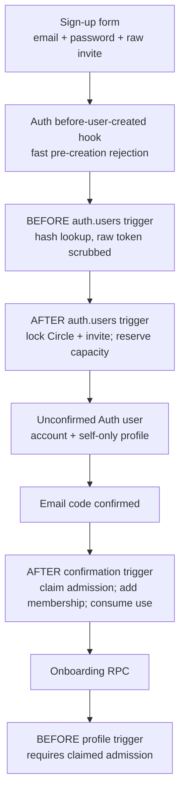

# Lesson 7 — Invitation-gated signup without leaking the invitation

> **Superseded architecture (July 29, 2026):** This lesson records a working design that Orca intentionally removed. Account signup is permanently open; invitations now control only entry to an existing Circle. Read [Lesson 8](./08-open-accounts-and-invite-only-circles.md) for the current architecture. This historical lesson remains useful for learning triggers and transactional reservations, but its described product flow is not active Orca behavior.

## Outcome

Orca’s production signup path is now invitation-gated in the **local database and app**. A new person must supply a private invitation code, confirm their email, and hold a claimed admission before they can complete onboarding. The code is a short-lived bearer capability: it enters Auth briefly, is converted into a hash-backed server record, and is scrubbed before the Auth user transaction commits.

This is the ninth migration, [`20260729072231_add_invitation_gated_signup.sql`](../../supabase/migrations/20260729072231_add_invitation_gated_signup.sql). It is now applied to hosted development, and the equivalent hosted Before User Created hook is enabled for the reviewed Postgres function. The migration and the Auth-service setting were promoted and verified separately because a database migration does not configure a hosted Auth hook by itself.

After promotion, local and hosted histories match across all nine migrations and both environments pass **285/285 pgTAP assertions**.

## Start here: one code, three different forms

The same invitation moves through three deliberately different representations:

| Stage                         | Representation                                          | Why it exists                                                                                          |
| ----------------------------- | ------------------------------------------------------- | ------------------------------------------------------------------------------------------------------ |
| Sign-up form and Auth request | Raw 64-character lowercase hexadecimal token            | The invited person must be able to present the capability.                                             |
| `circle_invites`              | SHA-256 `token_hash`                                    | The server can compare a presented token without storing the reusable raw value.                       |
| `signup_invite_admissions`    | `user_id`, `invite_id`, timestamps, claim/release state | It reserves capacity for a new Auth user until email confirmation decides whether membership is final. |

The raw token is not an account role, user ID, or permission embedded in a JWT. It is a bearer secret: anyone who has it can attempt to use it until the server rejects it as expired, revoked, full, or already claimed. That makes its lifetime and storage boundary important.



The important idea is that **the app asks; the database admits**. The UI makes the experience understandable, while Auth and Postgres enforce the result even when a request is forged or two signups arrive at once.

## The end-to-end story: Maya joins Alice’s Circle

1. Alice, a Circle admin, creates a one-use invite. Orca returns the raw code once and stores only its hash (Lesson 5).
2. Maya enters email, password, confirmation, and that code in the sign-up form. The app normalizes the code and refuses an obviously malformed value before sending it.
3. `supabase.auth.signUp` sends the raw code as transient `user_metadata.orca_invite_token`. A configured Auth hook can reject missing/invalid/unusable codes before a user is created; the database trigger still repeats the decision authoritatively.
4. A **BEFORE INSERT** trigger on `auth.users` hashes the raw token, identifies the server-side invite ID, stores that _temporary ID_ in `raw_app_meta_data`, and removes the raw token from `raw_user_meta_data`.
5. The existing **AFTER INSERT** Auth trigger creates Maya’s account/profile and, while holding the Circle then invite lock, creates a one-hour-or-less admission reservation. Maya has no Circle membership yet.
6. Maya enters her emailed confirmation code. The confirmation trigger either claims the admission, adds Maya as a member, and consumes one invite use—or safely releases the admission if the invite was revoked/expired while she waited.
7. If released, Maya lands at a recovery screen after verification. She can enter a fresh code through a narrow authenticated RPC. If claimed, normal profile/legal onboarding can proceed.
8. A **BEFORE UPDATE** trigger on `profiles` refuses the first `onboarding_completed_at` transition unless the required admission is claimed. A modified client cannot skip directly to a completed account.

## The app boundary: normalize early, but do not authorize here

The sign-up form owns typed text and display errors. It includes an invitation field only in sign-up mode:

```tsx
const credentials =
  mode === "sign-up" ? { email, password, inviteCode } : { email, password };
```

See [`email-password-form.tsx` lines 61–96](../../src/features/auth/email-password-form.tsx#L61-L96) and the field at [`lines 222–249`](../../src/features/auth/email-password-form.tsx#L222-L249). This is a normal React form concern: keep the raw code only in the component while the person is entering it, show accessibility-friendly validation, and prevent duplicate submission.

The action factory repeats the same normalization immediately before crossing the network boundary:

```ts
const inviteCode = normalizedInviteCode(credentials.inviteCode);

if (!INVITE_CODE_PATTERN.test(inviteCode)) {
  return {
    kind: "error",
    message: "Enter the 64-character invitation code from your friend.",
  };
}

await auth.signUp({
  ...normalizedCredentials(credentials),
  options: { data: { orca_invite_token: inviteCode } },
});
```

See [`auth-action-factory.ts` lines 101–135](../../src/features/auth/auth-action-factory.ts#L101-L135). `options.data` is how Supabase Auth initially receives the code. It is intentionally not used as authorization evidence later: `user_metadata` is user-editable. The database hashes and validates the code against its own protected rows.

If email confirmation is enabled, the successful client result has no session and the app routes to the existing six-digit verification screen. That is why the client result distinguishes `nextStep: { kind: "verify-email" }`; it is navigation information, not proof of admission.

## An Auth hook is helpful, not the final authority

The local Auth configuration points the before-user-created hook at a public function:

```toml
[auth.hook.before_user_created]
enabled = true
uri = "pg-functions://postgres/public/before_user_created_invitation_gate"
```

See [`supabase/config.toml` lines 286–290](../../supabase/config.toml#L286-L290). When the Auth service has loaded that setting, it calls this function as its internal `supabase_auth_admin` role before inserting a user. The function reads the gate mode, normalizes/hashes the metadata token, checks basic invite usability and reserved capacity, then returns either `{}` or a structured `403` error:

```sql
if v_token is null or v_token !~ '^[0-9a-f]{64}$' then
    return jsonb_build_object(
        'error', jsonb_build_object(
            'http_code', 403,
            'message', 'A valid invitation is required to create an account.'
        )
    );
end if;
```

See [`migration lines 206–281`](../../supabase/migrations/20260729072231_add_invitation_gated_signup.sql#L206-L281). It gives quick rejection and avoids creating an obviously uninvited user.

But the hook is **not authoritative**:

- Its hosted configuration could drift or be disabled.
- It is a preflight read, not the transaction that reserves capacity.
- Two hooks can both briefly observe one free use.

The `auth.users` trigger repeats validation and performs the capacity reservation under row locks. The test proves a direct Auth insert without a code fails even if the hook is bypassed. This is the same engineering pattern as client validation plus server validation, applied one layer earlier: useful preflight, trusted final boundary.

There is also a current local-tooling caveat: after the clean reset, pinned Supabase CLI `2.109.1` did not place the hook setting into the local Auth container environment even though `config.toml` uses the documented syntax. The real no-code Auth request was still denied by the authoritative database trigger, but GoTrue returned a generic internal signup failure instead of the hook's cleaner `403`. That is why hosted deployment must explicitly verify its Auth-hook setting rather than assuming the database migration or local file changed the hosted service. This mismatch affects error quality, not the security boundary.

## Why the scrub must be a BEFORE trigger

This checkpoint fixed a real persistence bug in the first design. The old `on_auth_user_created` hook is an **AFTER INSERT** trigger (see [`20260727041445...sql` lines 118–140](../../supabase/migrations/20260727041445_add_account_states_and_profiles.sql#L118-L140)). An AFTER trigger runs only after PostgreSQL has already chosen the stored row. Returning a modified `NEW` row from an AFTER trigger does **not** rewrite that row; PostgreSQL ignores that returned value for storage.

So an attempt to remove `NEW.raw_user_meta_data->'orca_invite_token'` in the AFTER trigger looked plausible in code but left the raw bearer token persisted in `auth.users`. The root cause was trigger timing, not a bad JSON expression.

The fix is a dedicated **BEFORE INSERT** trigger, plus a BEFORE metadata-update trigger to prevent a later Auth metadata update from reintroducing it:

```sql
new.raw_app_meta_data := coalesce(new.raw_app_meta_data, '{}'::jsonb)
    || jsonb_build_object('orca_signup_invite_id', v_invite_id);

new.raw_user_meta_data := coalesce(new.raw_user_meta_data, '{}'::jsonb)
    - 'orca_invite_token';

return new;
```

See [`migration lines 284–344`](../../supabase/migrations/20260729072231_add_invitation_gated_signup.sql#L284-L344). In a BEFORE row trigger, `NEW` is the proposed row. Returning that edited `NEW` is exactly how PostgreSQL stores the scrubbed value.

Only the invite UUID temporarily enters `raw_app_meta_data`, which is server-controlled metadata. Then the AFTER insertion handler creates its admission reservation and runs an explicit `UPDATE auth.users ... - 'orca_signup_invite_id'` to remove even that marker. No raw invitation token is ever needed after the BEFORE trigger.

## Reservation is what fixes the capacity race

One-use invitations become tricky when a person signs up but has not yet verified email. If capacity were consumed only on confirmation, two people could create accounts from the last invite before either confirms. If it were consumed permanently at signup, a mistyped or abandoned email could burn the invite forever.

`private.signup_invite_admissions` is the middle state. It records that an invite capacity slot is **reserved** for exactly one Auth user until it is claimed or released. Its partial index efficiently finds active reservations by invite:

```sql
create index signup_invite_admissions_active_invite_idx
on private.signup_invite_admissions (invite_id, expires_at)
where claimed_at is null and released_at is null;
```

See [`migration lines 24–53`](../../supabase/migrations/20260729072231_add_invitation_gated_signup.sql#L24-L53). The reservation expiry is the earlier of the invitation expiry and one hour after signup.

The authoritative insert handler uses a shared lock order—**Circle row, then invite row**—releases stale reservations, counts still-active reservations, and rejects when:

```sql
v_invite.use_count + v_reserved_count >= v_invite.max_uses
```

See [`migration lines 396–443`](../../supabase/migrations/20260729072231_add_invitation_gated_signup.sql#L396-L443). The Circle lock makes competing signup/reservation/redeem operations queue. The transaction that runs second sees the first reservation and fails instead of creating a second usable account.

The capacity rule is repeated where a new capacity claim can be made: invite preview/redemption, the Auth hook, the authoritative signup reservation, and recovery all account for active reservations. Confirmation is slightly different: it converts the caller’s already-reserved slot, so it locks and validates the invitation without counting that same reservation again. This prevents an existing user from redeeming capacity that a pending signup has reserved. For a recovery request, the count excludes the caller’s own existing admission while it replaces it; otherwise a person could falsely block their own fresh code.

## Confirmation, recovery, and onboarding are separate state transitions

The confirmation trigger does not assume a reservation is still good just because it existed at signup. It locks the account, admission, Circle, and invite; then either claims it or releases it without rolling back Auth verification:

```sql
if v_account_state is distinct from 'active'
   or v_admission.expires_at <= v_now
   or v_circle_state is distinct from 'active'
   or v_invite.revoked_at is not null
   or v_invite.use_count >= v_invite.max_uses then
    update private.signup_invite_admissions
    set released_at = coalesce(released_at, v_now)
    where user_id = new.id;
    return new;
end if;

insert into public.circle_members (circle_id, user_id, role)
values (v_invite.circle_id, new.id, 'member');
```

See [`migration lines 459–537`](../../supabase/migrations/20260729072231_add_invitation_gated_signup.sql#L459-L537). This failure behavior is intentional: Maya’s email is still verified, but she does not receive membership or onboarding permission from a revoked/expired code. She can recover instead of getting stuck in an impossible Auth transaction.

The onboarding route queries its own signup gate status alongside profile/legal state:

```ts
const needsFreshInvite =
  onboardingStateQuery.data.signupGate.invitation_required &&
  !onboardingStateQuery.data.signupGate.invitation_claimed;

if (needsFreshInvite) {
  return <SignupInviteRecoveryScreen ... />;
}
```

See [`src/app/(app)/onboarding.tsx` lines 91–105](<../../src/app/(app)/onboarding.tsx#L91-L105>). The recovery screen keeps a fresh code in local state, blocks duplicate requests, and clears it after a successful claim. The action calls only `public.replace_and_claim_own_signup_invite(p_token)`, which derives `auth.uid()` and requires a verified, active, pre-onboarding account. See [`onboarding-actions.ts` lines 95–136](../../src/features/onboarding/onboarding-actions.ts#L95-L136).

Finally, the database guards the transition the UI asks for:

```sql
if old.onboarding_completed_at is null
   and new.onboarding_completed_at is not null
   and config.mode = 'invitation_required'
   and not exists ( ... claimed_at is not null ... ) then
    raise exception 'A claimed signup invitation is required before onboarding'
        using errcode = '42501';
end if;
```

See [`migration lines 747–782`](../../supabase/migrations/20260729072231_add_invitation_gated_signup.sql#L747-L782). The UI route is a helpful guide; this trigger is the final boundary.

## Local development is deliberately different from hosted development

The migration’s database default is `invitation_required`. The checked-in local seed then explicitly changes only the local reset database to `development_open`:

```sql
update private.signup_gate_config
set mode = 'development_open'
where singleton;
```

See [`supabase/seed.sql`](../../supabase/seed.sql). The seed is not pushed by `supabase db push`, so hosted development retains the restrictive default after its eventual migration promotion. This is a deliberate founder-bootstrap shortcut, not a production mode switch. It must never be copied into hosted production or external-test data.

## Security and failure boundaries

- The only role that can execute the before-user-created hook is `supabase_auth_admin`; `anon`, `authenticated`, and `service_role` cannot call it directly.
- Both signup tables live in `private`, have RLS enabled, and are not a client-facing database API.
- Auth metadata is not authorization. The raw `user_metadata` token is scrubbed; the temporary app-metadata invite ID is server-derived and removed after reservation.
- A malformed, missing, expired, revoked, exhausted, or unknown code produces a generic safe error. It does not expose whether a particular private Circle or code exists.
- Unconfirmed accounts reserve capacity but receive no membership. Confirmation consumes exactly one use only when the still-valid reservation is claimed.
- A reservation that expires or is invalidated releases cleanly. The verified user sees recovery rather than a broken account.
- Recovery requires the currently authenticated, email-confirmed, active, not-yet-onboarded user. It cannot be used to authorize an arbitrary user ID.
- A modified app cannot call `complete_onboarding` to bypass admission because the profile trigger checks claimed state at the database.

## Concise glossary

| Term               | Plain-English meaning here                                                                                                              |
| ------------------ | --------------------------------------------------------------------------------------------------------------------------------------- |
| Bearer token       | A secret where possession is enough to present it; invite codes are bearer tokens.                                                      |
| Hash               | One-way fingerprint used for comparison without retaining the original invite.                                                          |
| Auth hook          | A function the Supabase Auth service calls at a defined Auth lifecycle point; useful early filter, not the sole authority.              |
| Trigger            | Database code that runs automatically when a table event happens, such as inserting an Auth user or confirming an email.                |
| `NEW`              | The proposed row in a row trigger. A BEFORE trigger can return an edited `NEW`; an AFTER trigger cannot change the stored row that way. |
| Reservation        | Temporary claim on one invite use while email confirmation is pending.                                                                  |
| Claimed / released | Claimed means membership/use count was finalized; released means no membership and capacity is available again.                         |
| `42501`            | PostgreSQL’s “not allowed” error code; Orca maps it to safe user-facing messages.                                                       |

## Evidence and how to review it

[`invitation_gated_signup_test.sql`](../../supabase/tests/invitation_gated_signup_test.sql) adds **38 pgTAP assertions**, bringing both clean local and hosted suites to **285 passing assertions**. It covers function grants/RLS, hook rejection, raw-token scrubbing, account/profile creation, reservation capacity, second-signup rejection without a partial Auth row, confirmation claim, revocation recovery, onboarding denial until a claim, and `development_open` behavior. Older fixture files now choose transaction-only bootstrap mode explicitly instead of depending on the local seed; the mode change rolls back with each test.

The hosted Auth endpoint was also called without an invite after enabling the hook. It returned the intended generic `403`, and a direct database query confirmed the probe email left zero `auth.users` rows. Both hosted advisors reported no issues.

The app tests cover normalized invite submission, malformed-code client short-circuiting, the form field/error behavior, fresh-code recovery, and duplicate recovery protection. The app suite was **56 tests** if unchanged at the final verification run.

A real local Auth + Mailpit pass also exercised the meaningful cross-service path: a code-free signup was denied with no Auth row, an invited account was created without persisting the raw token or internal marker, the confirmation email arrived, and its code finalized exactly one membership and invite use. The released-admission recovery path is covered by the database and app tests. This cross-service evidence proves the database trigger and confirmation flow work through the real Auth API; it also exposed the local CLI hook-loading mismatch described above.

For a review or debugging session, follow this order:

1. Was the code normalized to exactly 64 lowercase hex characters?
2. Did local Auth’s hook reject it before user creation, or did the BEFORE trigger reject it inside the insert transaction?
3. Was the raw key absent from `auth.users.raw_user_meta_data` after insert?
4. Does the admission exist, and is it active, claimed, or released?
5. At confirmation, is the Circle active and the invite unrevoked, unexpired, and within `use_count + reservations` capacity?
6. If the account is verified but unclaimed, does the own-status RPC route it to recovery rather than normal onboarding?

## Check your understanding

Why is the Auth hook only a useful early filter, while the locked reservation created by the database trigger is the authoritative protection against two people using the last invitation at the same time?
