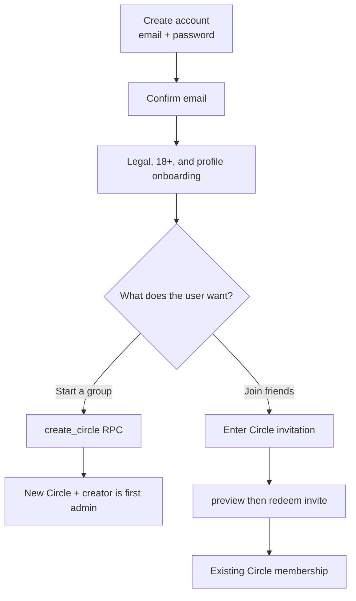

# Lesson 8 — Open accounts and invite-only Circles

## Outcome

Orca now separates two questions that the previous design accidentally combined:

1. **May this person create an Orca account?** Yes. Account creation is permanently open.
2. **May this account enter this private Circle?** Only with a valid Circle invitation or by creating that Circle.

This distinction lets a new organizer discover Orca, create an account, finish legal/18+ onboarding, and start a new Circle without knowing an existing user. Private group data is still protected because an account alone grants no membership in anyone else's Circle.

The corrective migration is [`20260730044326_restore_open_account_signup.sql`](../../supabase/migrations/20260730044326_restore_open_account_signup.sql). It follows the earlier hosted migration instead of editing it because an applied migration is immutable history: every environment must replay the same ordered changes.

## The current end-to-end flow



Notice that the branches happen **after onboarding**. Signup creates identity; Circle operations grant social access.

## The key app lines

The signup action now sends only normalized credentials:

```ts
const normalized = normalizedCredentials(credentials);
const { data, error } = await auth.signUp(normalized);
```

See [`auth-action-factory.ts`](../../src/features/auth/auth-action-factory.ts). There is no invite in `EmailPasswordCredentials`, no `user_metadata` handoff, and no invitation field in [`email-password-form.tsx`](../../src/features/auth/email-password-form.tsx). This is more than hiding a field: the signup layer has no invitation concept to accidentally depend on later.

Onboarding now loads only the user's profile and current legal acceptances:

```ts
const [profileResult, acceptancesResult] = await Promise.all([
  supabase
    .from("profiles")
    .select(/* own profile columns */)
    .eq("id", userId)
    .single(),
  supabase.from("legal_acceptances").select(/* document fingerprints */),
]);
```

See [`onboarding-api.ts`](../../src/features/onboarding/onboarding-api.ts). `Promise.all` starts the two independent reads together. The removed third read used to ask whether a signup invitation had been claimed. Because that state no longer exists, the recovery screen and RPC were deleted rather than left as dead complexity.

Circle invitation creation remains in the Circle feature. Its product default is now:

```ts
p_expires_at: addDays(now, 7),
p_max_uses: 10,
```

See [`circle-actions.ts`](../../src/features/circles/circle-actions.ts). One admin can paste a single code into a group chat; up to ten different accounts can redeem it during seven days. The database still caps `max_uses` at 100, but the app intentionally chooses the friend-group-sized default of 10.

## What the corrective SQL does

The migration removes the old signup-only machinery:

- the Supabase Before User Created hook function;
- signup admission/configuration tables;
- triggers that reserved an invite, finalized it at confirmation, scrubbed its metadata, or blocked onboarding;
- the authenticated signup-recovery and status RPCs;
- narrow Auth-service policies and grants that existed only for that hook.

It restores the normal Auth-user trigger:

```sql
create or replace function private.handle_new_auth_user()
returns trigger
language plpgsql
security definer
set search_path = ''
as $$
begin
    insert into private.account_states (user_id) values (new.id);
    insert into public.profiles (id) values (new.id);
    return new;
end;
$$;
```

Important vocabulary:

- A **trigger** runs a database function automatically after a table event. The existing Auth trigger calls this function after Supabase inserts `auth.users`.
- `NEW` is the Auth user row that caused the trigger. Here `new.id` is used as the matching app identity.
- `security definer` means the function runs with its owner's database privileges. That is necessary because an Auth insert must also write protected app tables.
- `search_path = ''` disables implicit schema lookup inside this privileged function. Every object is fully named (`private.account_states`, `public.profiles`), which prevents an attacker-controlled object with the same short name from being selected.
- `return new` tells PostgreSQL the row-trigger operation completed normally.

## Where authorization still lives

Open signup does **not** mean open data. These layers remain separate:

| Layer                    | What it decides                                                               |
| ------------------------ | ----------------------------------------------------------------------------- |
| Supabase Auth            | Is this a valid signed-in identity?                                           |
| Private account state    | Is the caller still active rather than suspended/deleting?                    |
| Legal/profile onboarding | Has this account accepted the exact current documents and 18+ statement?      |
| Circle RPCs              | May this onboarded caller create a Circle or redeem this invite?              |
| SQL grants + RLS         | Which tables/operations are reachable, and which rows can this caller access? |

RLS remains enabled on `circles`, `circle_members`, and `circle_invites`. Their policies use membership/admin checks. A random signed-in account therefore cannot enumerate or read another group's rows.

One account can belong to multiple Circles. The membership primary key is the pair `(circle_id, user_id)`, not `user_id` alone. That means Maya can have one membership row for “College Friends” and another for “Family”; only a second copy of Maya's membership in the same Circle is rejected. The reverse `(user_id, circle_id)` index makes loading Maya's full Circle list efficient.

This is the security principle to remember:

> Creating an identity is not the same as receiving authorization to private data.

## Why ordinary Circle redemption is race-safe

The old **signup recovery** existed only because an invitation could expire between account creation and email confirmation. With open signup, nothing about an expiring invite can damage the account, so that recovery state is gone.

A group invitation can still receive two redemption requests at the same instant. The remaining `private.redeem_circle_invite` handles this by locking shared rows in a fixed order:

1. lock and re-check the caller's active account;
2. identify the invitation;
3. lock the Circle row;
4. lock the invitation row;
5. re-check expiry, revocation, and `use_count < max_uses`;
6. insert membership and increment `use_count` in the same transaction.

`FOR UPDATE` makes competing transactions wait. When the second request wakes, it sees the first request's increment. This prevents the eleventh person from consuming a 10-use code. If the same user retries after already joining, the RPC returns `joined = false` without consuming another use; that is **idempotency**.

## Failure behavior

- Account signup failure never asks for a Circle code; it reports a generic safe Auth/network message.
- An account can be valid but belong to zero Circles. The UI should offer create/join actions as the normal empty state.
- Invalid, expired, revoked, or full Circle invitations return the same safe message, so the API does not reveal private Circle details.
- A user must be active and fully onboarded before creating or joining a Circle.
- Revoking an invite stops future redemptions; it does not remove people who already joined. Membership administration is a separate explicit action.
- The raw invitation is returned only when created and kept in transient UI state. The database stores only its SHA-256 hash.

## Verification evidence

The clean local database rebuild applies all ten migrations in order. The pgTAP suite has **259 passing assertions** and database lint reports zero warnings. [`open_account_signup_test.sql`](../../supabase/tests/open_account_signup_test.sql) specifically proves:

- signup-gate tables, functions, and triggers are gone;
- multiple Auth users can be created without invitations;
- each gets a profile and private active-account state;
- signup grants no Circle membership;
- a code-free user can complete onboarding and create a Circle;
- Circle creation atomically makes that user its first admin.

Existing Circle suites continue to test RLS, grants, invite expiry/revocation/capacity, replay/idempotency, membership changes, and last-admin protection. App tests verify that signup submits only email/password and the Circle action requests a 10-use invitation.

A real request through the local Supabase Auth HTTP endpoint also returned `200` for code-free signup with email confirmation pending. Two probe identities each received exactly one profile and one private account-state row, and received zero Circle memberships. This checks the full Auth-service-to-trigger boundary rather than relying only on direct SQL fixtures.

Hosted development is corrected. The obsolete Auth hook was deleted before promotion, only `20260730044326_restore_open_account_signup.sql` was applied, all ten migration versions match, and all **259 hosted assertions** pass. Direct schema checks confirm the signup tables/functions are absent and the multi-Circle membership key remains `(circle_id, user_id)`. Hosted Security and Performance Advisors have no warning/error findings; their remaining entries are expected INFO notices for deliberately unexposed private tables and one fresh legal index.

## Check your understanding

Why can Orca safely allow anyone to create an account while still guaranteeing that they cannot read a friend's Circle?
