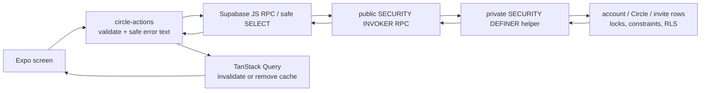

# Lesson 6 — The Circle app and safe lifecycle changes

> **Archived Circle-era lesson.** The query-cache, ephemeral-secret, and trusted lifecycle patterns remain useful, but the Circle screens and administration model are not part of friend-first V1. Do not treat this as the current application contract. See [`PROJECT.md`](../../../PROJECT.md).

## Outcome

Orca now has a usable local Circle flow: a signed-in, onboarded person can see their Circles, create one, preview and redeem a private invite code, inspect a roster, and—if they are an admin—manage invitations and memberships. The same checkpoint also adds the database contract that keeps Circle administration valid while an account is being deleted and gives an admin a trusted Circle-deletion request.

This is deliberately a **larger, connected checkpoint**. It joins the database rules from Lessons 4–5 to actual mobile screens without moving authorization into React Native.

At the time this lesson was verified, both new migrations were still **local-only**:

- [`20260729000116_add_circle_invites_and_membership_lifecycle.sql`](../../../supabase/migrations/20260729000116_add_circle_invites_and_membership_lifecycle.sql)
- [`20260729064610_add_account_deletion_and_circle_delete_contract.sql`](../../../supabase/migrations/20260729064610_add_account_deletion_and_circle_delete_contract.sql)

They must be dry-run against the exact linked development project and explicitly approved before promotion. Nothing in this lesson means they were applied to hosted development.

## Start here: the mental model

A Circle has two kinds of truth:

1. **Server truth** — who belongs to the Circle, who is an admin, whether an invitation is usable, and whether the Circle/account is active. Postgres owns this because a modified app or forged network request must not be able to bypass it.
2. **Screen state** — what the user has typed, whether a confirmation panel is open, and a newly-created raw invite token waiting to be copied. React owns this because it is temporary interface state.

TanStack Query sits between them. It caches _safe server results_ such as the Circle list and roster; it is not a second database. Mutations call an RPC, then invalidate or remove the cache entries that are now stale.



The direction matters: the UI may make the experience friendly, but only the database can decide whether Alice is still an admin or whether Bob may join. **A hidden button is not a permission check.**

### A concrete Alice and Bob story

1. Alice creates `Tuesday Crew`. The database inserts a Circle and makes Alice its first admin in one transaction.
2. Alice taps **Make one-time invite**. The server returns a newly generated 64-character token once, but stores only its SHA-256 hash.
3. Alice sends the raw code to Bob. On Bob’s phone, Orca normalizes it, previews only minimal context, and Bob chooses to join.
4. The redemption helper locks the Circle, then the specific invite. It rechecks the expiry, revocation, and remaining uses before adding Bob. If the network lost the original success response, Bob can retry: `joined: false` means he was already a member, not that the invite was spent twice.
5. Later, Alice begins account deletion. The private preparation helper changes her account to `deleting`, picks an eligible successor admin if she was the last admin, removes her memberships, and prevents a create/redeem operation that started at the same time from slipping through afterward.

The key lesson: a single user gesture can cross multiple layers, but the final permission and state-transition decision remains at the last trusted layer.

## What the app actually adds

The route files are intentionally thin. For example, the Home route gets the authenticated user ID and supplies navigation callbacks; it does not know how to load Circles:

```tsx
<CircleHubScreen
  onCreateCircle={() => router.push("/circles/create")}
  onJoinCircle={() => router.push("/circles/join")}
  onOpenCircle={(circleId) =>
    router.push({ pathname: "/circles/[circleId]", params: { circleId } })
  }
  userId={user?.id}
/>
```

See [`src/app/(app)/(tabs)/index.tsx` lines 6–18](<../../../src/app/(app)/(tabs)/index.tsx#L6-L18>). Keeping routes this small means the Circle feature can be tested as ordinary components and is not tangled with Expo Router.

The protected app layout registers the three new routes _inside_ the existing onboarding guard. A person cannot reach Circle screens merely by entering a path before profile/legal onboarding is complete. See [`src/app/(app)/_layout.tsx` lines 72–97](<../../../src/app/(app)/_layout.tsx#L72-L97>).

### Hub, creation, and joining

[`CircleHubScreen`](../../../src/features/circles/circle-hub-screen.tsx) handles loading, error, empty, and populated states. The “Everyone” card is currently an informational aggregate concept—not a database Circle and not a fake button. The actual aggregate feed arrives with post publishing.

Creating a Circle uses local form state for the name and a ref as an immediate double-submit guard:

```tsx
const inFlight = useRef(false);

async function handleCreate() {
  if (inFlight.current) return;
  inFlight.current = true;
  setError(null);
  const result = await createCircle.mutateAsync(name);
  inFlight.current = false;
  if (result.kind === "error") return setError(result.message);
  onCreated(result.value.id);
}
```

See [`create-circle-screen.tsx` lines 26–39](../../../src/features/circles/create-circle-screen.tsx#L26-L39). `useRef` holds a value across renders without causing a render itself. That is useful here because a second tap can occur before React has painted the mutation’s `isPending` state. The disabled button is the visible feedback; the ref is the small correctness backstop. The server repeats name validation because client validation is user experience, not a security boundary.

Joining deliberately has two steps:

```tsx
const preview =
  previewInvite.data?.kind === "success" ? previewInvite.data.value : null;

// no preview: validate the code and ask the server what it represents
// preview present: show the Circle name and let the person redeem it
```

See [`join-circle-screen.tsx` lines 23–48](../../../src/features/circles/join-circle-screen.tsx#L23-L48) and [`lines 86–131`](../../../src/features/circles/join-circle-screen.tsx#L86-L131). A preview is not admission. It only lets Bob recognize the intended private group before he calls the separate redeem operation.

The action layer owns normalization and safe client messages:

```ts
const INVITE_CODE_PATTERN = /^[0-9a-f]{64}$/;

export function normalizeInviteCode(value: string) {
  return value.trim().toLowerCase();
}
```

See [`circle-actions.ts` lines 60–88](../../../src/features/circles/circle-actions.ts#L60-L88). This prevents a pasted uppercase code from failing unnecessarily and avoids making a network request for a clearly malformed value. It does **not** claim a code is valid; the database still hashes, looks up, locks, and validates it.

## The query/cache boundary

[`circle-api.ts`](../../../src/features/circles/circle-api.ts) is a small transport adapter: it makes typed Supabase calls and throws fetch errors. `loadCircleDetail` starts the independent Circle, roster, and invite reads together:

```ts
const [circleResult, membersResult, invitesResult] = await Promise.all([
  supabase.from("circles").select(...).eq("id", circleId).single(),
  supabase.rpc("list_circle_members", { p_circle_id: circleId }),
  supabase.from("circle_invites").select(...).eq("circle_id", circleId),
]);
```

See [`circle-api.ts` lines 30–66](../../../src/features/circles/circle-api.ts#L30-L66). `Promise.all` is appropriate because none of these reads depends on another’s result. The database still filters each result independently; loading them together does not join permissions together.

[`circle-queries.ts`](../../../src/features/circles/circle-queries.ts) gives every cache key the current user ID:

```ts
export function circleDetailQueryKey(userId: string, circleId: string) {
  return ["circles", userId, circleId] as const;
}
```

See [lines 5–28](../../../src/features/circles/circle-queries.ts#L5-L28). This makes “Alice’s cached Circle detail” a different query from “Bob’s cached Circle detail.” The global Auth provider already clears user-scoped queries on identity changes; including the ID in the key makes that boundary explicit and reviewable.

After a normal mutation, the hook invalidates the hub and affected detail query so the next render refetches authoritative data. After a leave or deletion, it instead removes the exact detail query before navigating away:

```ts
queryClient.removeQueries({
  queryKey: circleDetailQueryKey(userId ?? "signed-out", circleId),
});
await invalidateCircles(circleId);
```

See [`circle-queries.ts` lines 121–141](../../../src/features/circles/circle-queries.ts#L121-L141). Removing is important for a permission loss: the old roster should not linger on-screen while a refetch discovers that the user is no longer allowed to see it.

### A raw invite token has a deliberately short lifetime

The newly-created token is the most sensitive value this screen sees. It is returned once by the RPC, saved in local component state, rendered in a selectable text field, then cleared when the user dismisses the card:

```tsx
const [createdInvite, setCreatedInvite] = useState<CreatedInvite | null>(null);
// ...
<Text selectable style={styles.token}>
  {createdInvite.token}
</Text>;
// ...
setCreatedInvite(null);
mutations.createDefaultInvite.reset();
```

See [`circle-detail-screen.tsx` lines 33–39 and 97–120](../../../src/features/circles/circle-detail-screen.tsx#L33-L39). The invite-creation mutation also uses `gcTime: 0`; TanStack Query does not retain its successful result in the mutation cache once it becomes unused. See [`circle-queries.ts` lines 68–76](../../../src/features/circles/circle-queries.ts#L68-L76).

This is risk reduction, not magic: a recipient can still copy, screenshot, or share a bearer code before it expires. The server limits it to one use, seven days in the current UI default, and allows an admin to revoke it.

## Database lifecycle work: keeping invariants true during deletion

The account-deletion helper is **not yet an app RPC**. It is a private foundation for the future trusted deletion orchestrator, which must later remove posts/media, revoke sessions, and delete the Auth identity last. It begins by deriving the caller—not accepting an arbitrary user ID—and locking that caller’s lifecycle row:

```sql
v_user_id uuid := auth.uid();

select account.state
into v_account_state
from private.account_states account
where account.user_id = v_user_id
for update;

if v_account_state is null
   or v_account_state not in ('active', 'deleting') then
    raise exception 'An active account is required' using errcode = '42501';
end if;
```

See [`20260729064610...sql` lines 13–43](../../../supabase/migrations/20260729064610_add_account_deletion_and_circle_delete_contract.sql#L13-L43).

- `auth.uid()` reads the verified subject of the request JWT. It is the database-side answer to “who is calling?”
- `FOR UPDATE` holds a row lock until this transaction ends. A concurrent create/redeem request for the same account waits and then rechecks the new state.
- `42501` is PostgreSQL’s insufficient-privilege SQLSTATE. The app maps it to a safe permission message rather than exposing private details.

If the deleting member is the only admin in a nonempty Circle, the helper promotes one deterministic successor: first the earliest joined member whose account is still `active`, then the earliest remaining member as a fallback. See [`lines 88–129`](../../../supabase/migrations/20260729064610_add_account_deletion_and_circle_delete_contract.sql#L88-L129). This preserves the invariant “a nonempty Circle has at least one admin” even in an awkward situation where every remaining account is suspended or deleting.

For a one-person Circle, Phase 3 can safely delete the Circle and cascade its empty-era dependencies. Once posts and private media exist, a later deletion workflow must perform media/content cleanup before removal; that later checkpoint replaces this limited shortcut.

### Lock order is a design rule, not decoration

Database locks are safest when every operation takes shared resources in the same order. This checkpoint uses:

```text
account lifecycle row → Circle row → invite/member row
```

For account preparation across several Circles, those Circle UUIDs are visited in sorted order. See [`lines 45–57`](../../../supabase/migrations/20260729064610_add_account_deletion_and_circle_delete_contract.sql#L45-L57). Otherwise two concurrent account deletions that share two Circles could each lock one Circle and wait forever for the other.

The migration also replaces `create_circle` and `redeem_circle_invite` so both lock and revalidate the account row before they create membership. See [`lines 257–301`](../../../supabase/migrations/20260729064610_add_account_deletion_and_circle_delete_contract.sql#L257-L301) and [`lines 303–406`](../../../supabase/migrations/20260729064610_add_account_deletion_and_circle_delete_contract.sql#L303-L406). That closes this race:

```mermaid
sequenceDiagram
    participant D as "Delete account"
    participant C as "Create / redeem request"
    participant DB as "Postgres"
    D->>DB: lock account; set state deleting
    C->>DB: tries to lock same account
    DB-->>C: waits
    D->>DB: lock affected Circles, select successor, remove memberships; commit
    DB-->>C: lock granted; sees deleting state
    C-->>C: reject with 42501; no new Circle/membership
```

Without the account lock, a request could check “active,” pause, then write a new membership after deletion preparation had supposedly finished.

## The Circle deletion request: public façade, private authority

The app calls `public.request_circle_deletion`. The public wrapper is `SECURITY INVOKER`, so it uses the request caller’s normal privileges; it simply routes to the private helper:

```sql
create function public.request_circle_deletion(p_circle_id uuid)
returns table (circle_id uuid, completed boolean)
language plpgsql security invoker set search_path = '' as $$
begin
    return query
    select * from private.request_circle_deletion(p_circle_id);
end;
$$;
```

See [`migration lines 227–238`](../../../supabase/migrations/20260729064610_add_account_deletion_and_circle_delete_contract.sql#L227-L238).

The private helper is `SECURITY DEFINER` because it performs an atomic protected write that direct table grants do not allow. **Definer does not mean “skip authorization.”** It independently checks `auth.uid()`, locks and rechecks the caller's active/onboarded account row, then validates active admin membership while holding the Circle lock. That account-first order also closes the account-deletion race for this operation. It uses `set search_path = ''` and fully-qualified table names. An empty search path prevents a privileged function from resolving an attacker-created object with an expected-looking name.

```sql
select circle.state
into v_circle_state
from public.circles circle
where circle.id = p_circle_id
for update;

if not exists (
    select 1 from public.circle_members member
    where member.circle_id = p_circle_id
      and member.user_id = v_user_id
      and member.role = 'admin'
) then
    raise exception 'Circle admin access is required' using errcode = '42501';
end if;
```

See [`migration lines 143–225`](../../../supabase/migrations/20260729064610_add_account_deletion_and_circle_delete_contract.sql#L143-L225). It gives missing IDs and unauthorized callers the same generic `42501` result, avoiding a Circle-existence oracle. In this pre-post phase the request transitions `active → deleting`, revokes invitations, then removes the Circle and cascades memberships/invites in the same transaction. A later content/media phase will retain the state transition while a trusted worker completes longer cleanup.

There is no trigger in this migration, so PostgreSQL’s `NEW` record is not relevant here. `NEW` is the name for the proposed row inside a row-level trigger (for example, a `BEFORE INSERT` trigger); this checkpoint uses explicit functions and statements instead.

## Ownership table: who is allowed to decide what?

| Concern                                          | Owner                                | Why                                                            |
| ------------------------------------------------ | ------------------------------------ | -------------------------------------------------------------- |
| Field text, open confirmation panel, spinner     | React component state                | It is temporary and private to one screen.                     |
| Invite format and trimmed Circle name            | `circle-actions.ts`, repeated by SQL | Client feedback is fast; server repetition is authoritative.   |
| Circle list/detail/roster/invite metadata        | TanStack Query                       | Remote data cache with controlled refetching.                  |
| Current user identity/session                    | Auth provider                        | Auth has its own lifecycle and is not query data.              |
| Membership, roles, invites, account/Circle state | Postgres                             | The shared security-critical source of truth.                  |
| Permission, final-admin/successor rules, locks   | private database helpers             | A client cannot reliably enforce shared concurrent invariants. |

RLS still protects ordinary table reads in the exposed schema. Function grants decide _who may call a function_, RLS decides _which table rows an allowed caller can read_, and the private helpers decide whether an **atomic multi-row change** is legal. None replaces the others.

## Failure and security behavior worth noticing

- Invalid code shape is rejected locally; malformed, expired, revoked, exhausted, or unknown codes receive one safe server-facing error instead of a detailed invitation oracle.
- A preview does not grant membership; redemption rechecks everything under locks.
- A same-user redemption retry is a success with `joined: false`, so a lost network response does not produce a confusing failure or consume another use.
- A non-admin cannot create/revoke invitations, alter roles, remove members, or delete a Circle—even if a modified client displays the control.
- Last-admin removal/demotion/leave is still rejected by the database. The app confirmation panel is intentional UX, not the invariant.
- A `deleting` account loses normal Circle operations immediately. Account preparation itself is private-only; no public API role can invoke it directly.
- The raw invite is never stored in a query key, database column, or app log. It lives briefly in component state and the user must save it intentionally.
- Circle deletion is immediately final for this no-post/no-media phase. Before posts exist, the app should clearly say it ends the Circle for every member; later phases need a content/media cleanup receipt before claiming completion.

## Tests: what they prove, and what they do not

The new SQL test file, [`account_deletion_and_circle_delete_contract_test.sql`](../../../supabase/tests/account_deletion_and_circle_delete_contract_test.sql), adds **41 pgTAP assertions**. Together with the earlier Circle migration tests, the clean local suite had **247 passing pgTAP assertions**.

The focused assertions prove that:

- the account-preparation helper has no public wrapper and API roles cannot execute it;
- the private helpers are `SECURITY DEFINER`, the public deletion RPC is `SECURITY INVOKER`, and all pin `search_path`;
- account state changes to `deleting`, memberships are removed, a one-person Circle is deleted, and the successor choice is deterministic;
- suspended/deleting/outsider/ordinary-member callers cannot delete a Circle;
- an admin deletion cascades the Circle’s memberships and invitations, while a retry and a forged Circle ID produce the same generic denial;
- create/redeem re-lock the account state, so normal operations reject a caller whose lifecycle has moved to deleting.

The app tests are smaller and deliberately focused. [`circle-actions.test.ts`](../../../src/features/circles/__tests__/circle-actions.test.ts) proves trimming, normalization, malformed-code short-circuiting, idempotent redemption mapping, and the seven-day/one-use default. [`join-circle-screen.test.tsx`](../../../src/features/circles/__tests__/join-circle-screen.test.tsx) proves the screen displays a safe validation error and turns an uppercase pasted code into the normalized code sent to redemption. At the checkpoint, the full app suite had **50 passing tests**.

Tests do not replace a manual simulator pass. Before external testers, try: empty hub → create Circle → create/dismiss invite → second account joins → promote/demote/remove with confirmations → leave → verify the former member cannot reopen the Circle. Physical iPhone acceptance, hosted promotion, custom Auth SMTP/template work, and invitation-gated signup remain separate gates.

## Debugging lab: trace one failure from the screen down

Suppose Bob taps **Join Tuesday Crew** and sees “That invitation is invalid, expired, revoked, or already full.” Work down this short list instead of changing code at random:

1. In the join screen, confirm the displayed code is exactly 64 lowercase hexadecimal characters after `normalizeInviteCode`.
2. Check whether preview had returned `is_usable: true`; preview and redemption are separate requests, so the invite might have been revoked or used between them.
3. In the RPC path, check the caller’s account state/onboarding. An unverified or deleting account is meant to fail.
4. Check Circle state, `revoked_at`, `expires_at`, `use_count`, and `max_uses` after the Circle + invite locks are acquired.
5. If the user is already a member, expect success with `joined: false`, then navigate to the Circle rather than displaying an error.

For a stuck admin action, inspect the same order: caller identity → account state → current membership role → Circle state → target membership → final-admin rule. Do not start by weakening RLS or changing a button. The error often means one of those security checks is correctly doing its job.

## Review checklist

Before extending this feature, ask:

- Is the route still thin and is feature UI/logic outside it?
- Is every query key scoped by user ID, and is permission loss using `removeQueries` rather than leaving a stale roster visible?
- Does a new mutation invalidate the hub and the relevant detail query?
- Does any sensitive transient value (especially a bearer token) avoid logs, persistent storage, and query cache?
- Does every server mutation derive `auth.uid()` instead of trusting a requested user ID?
- Does a new private `SECURITY DEFINER` helper have an empty `search_path`, fully-qualified references, narrow grants, and its own authorization checks?
- Does it obey `account → Circle → child row` lock order and recheck state after locks?
- Is there a negative authorization test and, when an invariant spans users, a real concurrency test?
- If data/media is added later, has the old Phase 3 deletion shortcut been replaced with the documented cleanup workflow?

## Check your understanding

Alice is the only admin of a Circle with Bob as a member. Why must account deletion lock Alice’s account row **before** it chooses Bob as successor and why must every affected Circle then be locked in the same order as other Circle mutations?
